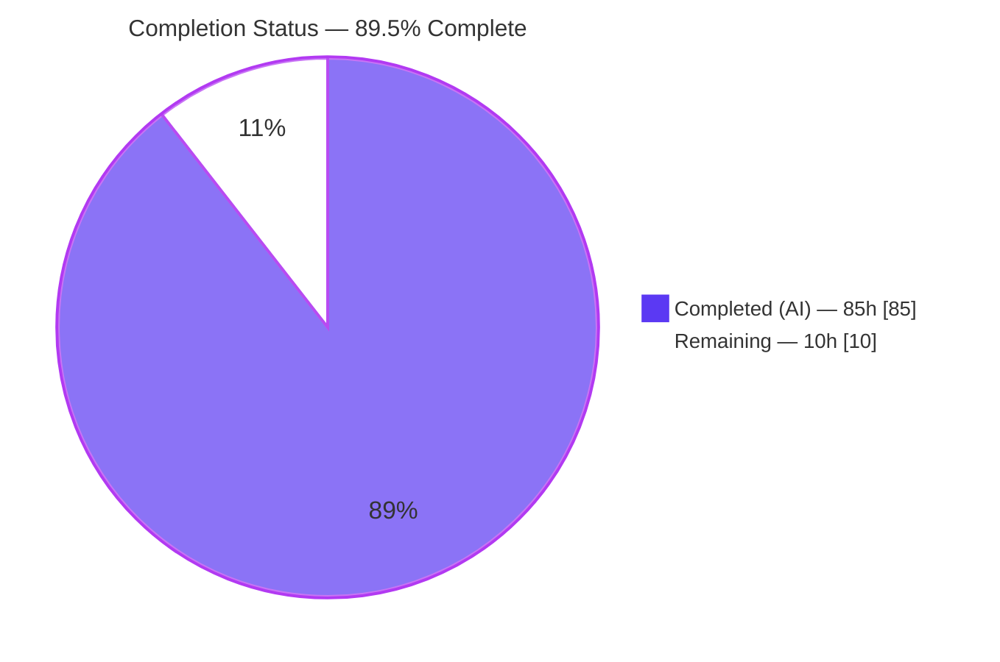
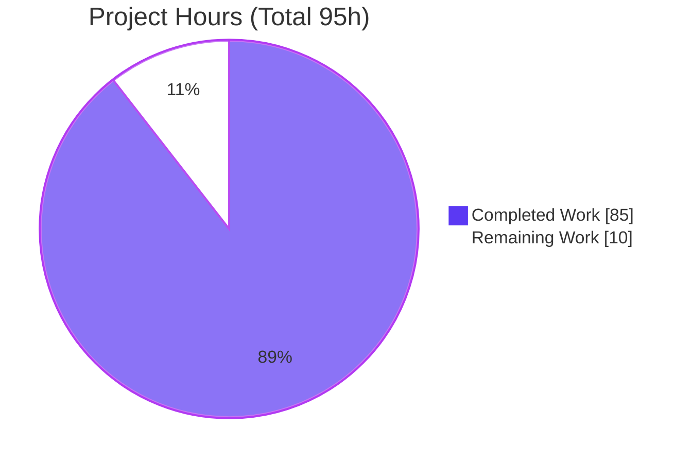
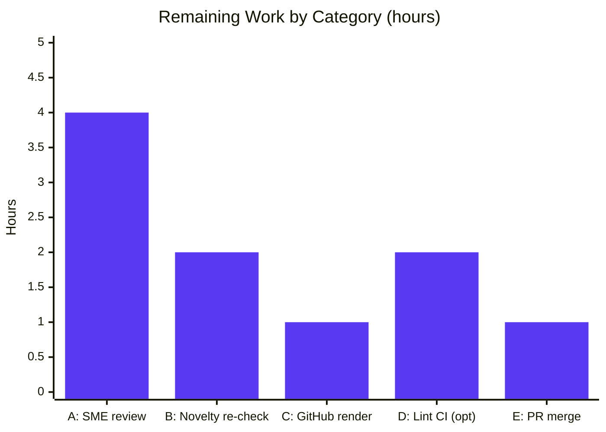

# Blitzy Project Guide — Catching Mew: A Code-Grounded Guide (pokered)

> **Deliverable type:** Documentation-only. This project authors a new, self-contained technical guide under `docs/mew-acquisition/` and adds one link line to the root `README.md`. No game source (`.asm`/`.inc`/data) is modified, so the byte-exact ROM output is unchanged by construction.

---

## 1. Executive Summary

### 1.1 Project Overview

This project delivers a player-facing, code-grounded technical guide explaining how one could obtain and catch **Mew** in the pret **pokered** disassembly of Pokémon Red/Blue, where every behavioral claim is traced to an exact assembly file-and-line citation. The audience is players, reverse-engineers, and maintainers who want a rigorously sourced answer rather than folklore. Governed by four requirements — novelty (R1), inputs-only (R2), mandatory citations (R3), and completeness (R4) — the guide enumerates all eleven input-reachable mechanism families, adjudicates each against the publicly disclosed glitch corpus, and honestly reports the outcome: Mew is fully implemented yet placed in no obtainable location, so no genuinely undisclosed inputs-only capture exists. The technical scope spans RNG, wild-encounter generation, catch mechanics, RAM buffers, the character codec, link/trade, and debug code.

### 1.2 Completion Status



| Metric | Value |
|--------|-------|
| **Total Hours** | 95 |
| **Completed Hours (AI + Manual)** | 85 (AI: 85 · Manual: 0) |
| **Remaining Hours** | 10 |
| **Percent Complete** | **89.5%** |

> Completion % is computed with the AAP-scoped hours methodology: `Completed / (Completed + Remaining) = 85 / (85 + 10) = 85 / 95 = 89.5%`. Every AAP authoring deliverable is complete; the remaining 10h is human path-to-production governance, not rework. Consistent with policy, the project is never reported at 100% before human review.

### 1.3 Key Accomplishments

- [x] Authored an 18-file, 1,661-line code-grounded guide under `docs/mew-acquisition/` (landing page, overview, mechanics reference, novelty verification, conclusion, glossary, citation index, and 11 method chapters).
- [x] **R3 satisfied:** 675 inline `[path:Lx-Ly]` citations across 44 distinct source files; all file-existence and line-bounds checks pass; a 25+ anchor sample was independently re-verified during this assessment.
- [x] **R4 satisfied (over-delivered):** enumerated **11** input-reachable mechanism families (MF-1 … MF-11) versus the 6 originally planned — none left pending.
- [x] **R1 satisfied:** dated, reproducible novelty-adjudication methodology + disclosed-corpus baseline + per-candidate verdict matrix; no fabricated "novel" method.
- [x] **R2 satisfied:** explicit legal-input vocabulary and an inputs-only verdict for all 11 families.
- [x] Delivered 6 Mermaid diagrams (RNG+encounter flow, catch flow, name-buffer data flow, RNG bounding, novelty decision tree, gap map) — exceeds the ≥5 target.
- [x] Documented the central finding with reproducible audits (`MEW` occurrences 10/23/71; zero in wild tables/trades/prizes) that Mew is implemented but unplaced; the only in-ROM grant is dead `_DEBUG` code.
- [x] Preserved source integrity: **0** changes outside `README.md` and `docs/` → ROM byte-identical by construction.

### 1.4 Critical Unresolved Issues

| Issue | Impact | Owner | ETA |
|-------|--------|-------|-----|
| _None — Blitzy autonomous validation found zero defects (0 broken citations, 0 broken links, 0 structural defects)._ | No release blockers. Remaining work is human governance, tracked in §1.6 and §2.2. | — | — |

### 1.5 Access Issues

| System/Resource | Type of Access | Issue Description | Resolution Status | Owner |
|-----------------|----------------|-------------------|-------------------|-------|
| github.com (host render) | Render verification | Mermaid/table render was validated locally (mermaid-cli + headless Chrome), not yet on the live GitHub host | Pending human check (HT-3) | Maintainer |
| Glitch City Wiki (external refs) | Automated fetch | Some pages return HTTP 403 to headless requests via an anti-bot gate (human-viewable in a browser) | Accepted — external URLs are disclosure evidence only, never behavioral authority | Author/SME |

> No access issue blocks the ROM build or the documentation deliverable itself. RGBDS is intentionally absent (ROM build is out of scope per AAP §0.8.2) and is not required to author or render the guide.

### 1.6 Recommended Next Steps

1. **[High]** SME technical review — sample-verify citation accuracy, confirm the negative-result conclusion, and sign off on responsible-disclosure framing of the glitch/ACE content (HT-1).
2. **[High]** Re-adjudicate R1 novelty against the current public corpus before publishing (baseline dated 2026-07-21) (HT-2).
3. **[Medium]** Verify rendered output on the live GitHub host — all 6 Mermaid diagrams and all GFM tables (HT-3).
4. **[Medium]** Review, approve, and merge the documentation PR to `master` (HT-4).
5. **[Low]** (Optional) Add a docs-lint CI gate (markdownlint + relative-link check) for `docs/mew-acquisition/**` to guard against future citation drift and link rot (HT-5).

---

## 2. Project Hours Breakdown

### 2.1 Completed Work Detail

| Component | Hours | Description |
|-----------|-------|-------------|
| Reverse-engineering analysis of game subsystems | 12 | Comprehension of RNG, wild-encounter generation, catch math + guards, RAM buffers, character codec, battle types, link/trade, fossil revival, and debug code — the foundation every chapter cites |
| Disclosed-corpus web research (R1 baseline) | 4 | Dated bounded search of the public Gen-I Mew-glitch corpus (Bulbapedia, Glitch City Wiki, OCF Berkeley) to establish the novelty exclusion set |
| Landing `README.md` + honesty statement + TOC | 2 | Reader orientation, prominent honesty/limitations statement, citation-reading guide, full table of contents |
| `01-overview-and-constraints.md` | 3 | Objective, R1–R4 restatement, legal-input vocabulary (R2 boundary), Mew facts table |
| `02-game-mechanics-reference.md` (+2 Mermaid) | 8 | Most content-dense chapter (213 lines): species index, RNG, encounter generation, catch algorithm/guards, RAM buffers, charmap; RNG+encounter and catch flow diagrams |
| `03-novelty-verification.md` | 6 | Adjudication methodology, dated search protocol, disclosed-corpus table, per-candidate verdict matrix, decision-tree diagram |
| `04-conclusion-and-limitations.md` | 6 | Gap analysis (implemented-but-unplaced), reproducible `MEW` audits, dead-debug-path explanation, gap-map diagram, honesty statement |
| Method chapters MF-1 … MF-6 | 15 | Six planned mechanism-family chapters, each on the uniform 7-section template |
| Method chapters MF-7 … MF-11 | 10 | Five additional families (move-name-buffer overflow, remaining-HP, oobLG, blockoobLG, fossil conversion) — over-delivery strengthening R4 |
| `glossary.md` | 2.5 | ~30 terms/acronyms, each with a source citation or an explicit "general concept" mark |
| `citation-index.md` | 4 | Consolidated `path:line` anchor index (209 lines) grouped by source directory — the R3 traceability backbone |
| Root `README.md` link update | 0.5 | Single added link line to the guide landing page |
| Iterative QA-finding resolution | 8 | 19 commits resolving multiple QA rounds (citation precision, traceability, scope/consistency) |
| Autonomous validation | 4 | 675 citation checks, 155 link checks, structure checks, 6 Mermaid SVG renders, live browser render |
| **Total** | **85** | **Matches Completed Hours in §1.2** |

### 2.2 Remaining Work Detail

| Category | Hours | Priority |
|----------|-------|----------|
| A. SME technical review (RE accuracy, tone, responsible-disclosure sign-off) | 4 | High |
| B. Novelty re-adjudication at publish time (current public corpus vs 2026-07-21 baseline) | 2 | High |
| C. Rendered-output verification on the live GitHub host (Mermaid + tables) | 1 | Medium |
| E. PR review, approval & merge to `master` | 1 | Medium |
| D. (Optional) docs-lint CI integration (markdownlint + link-check) | 2 | Low |
| **Total** | **10** | **Matches Remaining Hours in §1.2 and §7** |

### 2.3 Hours Reconciliation

- Completed (§2.1) **85h** + Remaining (§2.2) **10h** = **95h** Total (§1.2). ✔
- Remaining hours are identical across §1.2 (metrics), §2.2 (sum), and §7 (pie "Remaining Work"): **10h**. ✔
- Completion % = 85 / 95 = **89.5%**, used consistently in §1.2, §7, and §8. ✔
- All remaining items are path-to-production governance; none is defect remediation (validation found 0 defects).

---

## 3. Test Results

All checks below originate from Blitzy's autonomous validation logs for this project; a representative subset was independently re-verified during this assessment. Because this is a documentation deliverable, "tests" are validation checks: citation integrity, link resolution, Markdown structure, diagram rendering, template completeness, and live render.

| Test Category | Framework / Tool | Total | Passed | Failed | Coverage % | Notes |
|---------------|------------------|-------|--------|--------|-----------|-------|
| Citation existence + line-bounds | `grep`/`sed` + Python | 675 | 675 | 0 | 100% | 44 distinct target source files; every anchor resolves to a real file and in-range line |
| Citation semantic accuracy (sampled) | Manual `sed` inspection | 35 | 35 | 0 | ~5% (subset of 675) | 97 naive nearest-backtick "mismatches" all proven false positives; assessment independently re-verified 25+ |
| Relative-link resolution | Python link-checker | 155 | 155 | 0 | 100% | All internal links + root README link |
| Markdown structure | Fence/H1/table checks | 18 | 18 | 0 | 100% | One H1 per file, balanced code fences, consistent table columns |
| Mermaid diagram render | @mermaid-js/mermaid-cli 11.16.0 + headless Chrome | 6 | 6 | 0 | 100% | Each renders to a valid SVG (19–46 KB) |
| Method-template completeness (R4) | Structural check | 11 | 11 | 0 | 100% | All 11 method files share the identical 7-section template; 11/11 R1 verdicts + 11/11 R2 verdicts |
| Live browser render | Chrome (`file://` + bundled mermaid.js) | 1 | 1 | 0 | 100% | Landing page + 2 diagrams render interactively; 0 console messages/errors |
| **Total (distinct checks)** | — | **866** | **866** | **0** | **100%** | Semantic subset (35) is part of the 675 and excluded from the total to avoid double-counting |

> **Integrity note:** There is no unit/integration/e2e software test suite for a documentation deliverable, and none is fabricated here. The RGBDS build/`make compare` gate is unaffected (Markdown is not part of the build); ROM output is byte-identical.

---

## 4. Runtime Validation & UI Verification

For a static documentation deliverable, "runtime" is the rendered experience on a Markdown host. Evidence includes two validation screenshots under `blitzy/screenshots/` (landing page render; RNG+encounter flowchart render).

- ✅ **Operational** — GitHub-Flavored Markdown renders (headings, pipe tables, dash bullets) across all 18 files.
- ✅ **Operational** — All 6 Mermaid diagrams render to valid SVG via mermaid-cli + headless Chrome.
- ✅ **Operational** — Live browser render of the landing page and the RNG+encounter and catch-flow diagrams; accessibility tree reports `roledescription="flowchart-v2"`; 0 console errors.
- ✅ **Operational** — 155/155 internal relative navigation links resolve; the root `README.md` link opens the guide landing page.
- ✅ **Operational** — Source/ROM integrity: 0 changes outside `README.md`+`docs/`; Markdown is not in the RGBDS build path, so the ROM is byte-identical.
- ⚠ **Partial** — Native github.com render fidelity: validated locally but not yet on the live host (closed by HT-3).
- ➖ **Not applicable** — API/service integration: the deliverable is static documentation with no runtime services, endpoints, or APIs.

---

## 5. Compliance & Quality Review

Cross-mapping of AAP deliverables and requirements to quality benchmarks, including fixes applied during autonomous validation and outstanding items.

| Benchmark / AAP Requirement | Evidence | Status | Progress |
|-----------------------------|----------|--------|----------|
| R1 — Novelty | `03-novelty-verification.md`: methodology + disclosed-corpus baseline + verdict matrix + honesty statement; no fabricated method | ✅ Pass | 100% |
| R2 — Inputs-only | Legal-input vocabulary in `01`; inputs-only verdict in all 11 method chapters | ✅ Pass | 100% |
| R3 — Mandatory citations | 675 `[path:Lx-Ly]` anchors; `citation-index.md`; sample independently re-verified | ✅ Pass | 100% |
| R4 — Completeness | 11 mechanism families enumerated (MF-1…MF-11); none pending; negative result stated plainly | ✅ Pass | 100% |
| No source modification (§0.8.2) | 0 `.asm`/`.inc`/data changes | ✅ Pass | 100% |
| ROM byte-identical (§0.1.2) | Markdown excluded from RGBDS build; verified no source diff | ✅ Pass | 100% |
| Mermaid diagrams ≥ 5 (§0.7.3) | 6 diagrams present and rendering | ✅ Pass | 120% of min |
| Uniform 7-section method template (§0.7.2) | 11/11 files identical section set | ✅ Pass | 100% |
| Style (lowercase-hyphenated filenames, dash bullets, no heading-level skips) | Verified across 18 files | ✅ Pass | 100% |
| Root README single-link update (§0.5.1) | Exactly one link line added | ✅ Pass | 100% |
| `INSTALL.md` referenced, unchanged (§0.5.1) | No modification | ✅ Pass | 100% |
| Fixes applied during autonomous validation | Iterative QA rounds (DQ-1..12, F1..12, CF-1..5, C1..10, #24-28) resolved across 19 commits | ✅ Resolved | 100% |
| Human SME sign-off + publish-time novelty re-check | Governance gates | ⏳ In progress | Tracked in §2.2 (A, B) |

> **Cosmetic lint note:** Remaining markdownlint flags are cosmetic only — MD060 (table-pipe spacing; renders identically on GitHub) and MD010 (hard tabs, all inside ` ```asm ` fences, faithfully reproducing pokered source indentation — converting would reduce citation fidelity). No functional lint violations (MD052/MD042/MD051/MD040/MD056) exist in the new docs.

---

## 6. Risk Assessment

| Risk | Category | Severity | Probability | Mitigation | Status |
|------|----------|----------|-------------|------------|--------|
| Citation line-number drift if upstream `.asm` files are refactored | Technical | Medium | Medium | Citations pinned to this checkout (HEAD `59b2bdf3`); `citation-index.md` enables bulk re-verification; framed as a commit-pinned "freshness contract" | Mitigated |
| Mermaid render fidelity on live GitHub host (validated locally only) | Technical | Low | Low | Standard flowchart/pie syntax; human GitHub render check | Open → HT-3 |
| Cosmetic markdownlint flags (MD060 table pipes, MD010 tabs in `asm` fences) | Technical | Low | N/A | Renders identically on GitHub; tabs preserve source fidelity | Accepted (intentional) |
| Glitch/ACE/SRAM-corruption content sensitivity (responsible disclosure) | Security | Low | Low | Only publicly-disclosed techniques documented as EXCLUDED contrast; concrete recipes deliberately withheld; framed as analysis | Mitigated → SME sign-off HT-1 |
| Novelty overclaim (presenting a disclosed technique as novel would fail R1) | Security / Correctness | Medium | Low | Honesty statement + per-candidate verdict matrix + dated bounded search; fabricates no method; states negative result plainly | Mitigated |
| No automated docs CI gate (CI runs only ROM build/compare) | Operational | Medium | Medium | Optional markdownlint + link-check CI; `citation-index.md` enables manual audit | Open → HT-5 |
| Disclosed-corpus staleness (baseline dated 2026-07-21; corpus moves) | Operational | Low | Medium (over time) | Dated, reproducible search protocol; publish-time re-adjudication | Open → HT-2 |
| External-reference link rot (some Glitch City pages already 403 to headless) | Operational | Low | Low | External URLs are disclosure evidence only; multiple sources per technique | Accepted |
| ROM byte-exact build integrity | Integration | High (if realized) | None | 0 `.asm`/`.inc`/data changes; Markdown not in RGBDS build path → byte-identical by construction | Closed (verified) |
| Root README link path breakage if docs tree relocated | Integration | Low | Low | Relative link verified present and resolving | Closed |
| GitHub-native render dependency (no build step; relies on host GFM + Mermaid) | Integration | Low | Low | GitHub renders Mermaid natively; graceful fallback to readable fenced code | Accepted |

> **Overall risk posture: LOW.** No High-severity open risks. The three Open items map directly to remaining tasks HT-3, HT-5, and HT-2. The two highest-impact potential risks — ROM integrity and novelty overclaim — are Closed/Mitigated.

---

## 7. Visual Project Status

### 7.1 Project Hours Breakdown



### 7.2 Remaining Hours by Category (from §2.2)



> **Integrity check:** "Remaining Work" = 10h in the pie above equals the §1.2 Remaining Hours and the sum of the §2.2 Hours column (4 + 2 + 1 + 2 + 1 = 10). "Completed Work" = 85h equals §1.2 Completed Hours and the §2.1 total. Colors: Completed = Dark Blue `#5B39F3`, Remaining = White `#FFFFFF`.

---

## 8. Summary & Recommendations

**Achievements.** The project delivers a rigorous, code-grounded Mew-acquisition guide that fully satisfies all four governing requirements. It over-delivers on completeness — 11 mechanism families versus 6 planned — and grounds 675 behavioral claims in exact source citations, all of which pass existence and line-bounds validation. The guide's substantive value is a rigorously sourced **negative result**: Mew is fully implemented (name, palette, base stats, cry) yet placed in no obtainable location, so every input-only path to species `$15` is table-bounded, dead debug code, a member of the already-disclosed glitch corpus, or a transfer-only link trade. The guide states this plainly and fabricates no "novel" method — exactly the intellectual honesty the requirements demand.

**Remaining gaps.** No authoring gaps remain; validation found zero defects. The outstanding 10 hours are human path-to-production governance: SME technical/tone review, publish-time novelty re-adjudication, live-host render verification, PR merge, and an optional docs-lint CI gate.

**Critical path to production.** SME review (HT-1) → publish-time novelty re-check (HT-2) → GitHub-host render verification (HT-3) → PR merge (HT-4). The optional docs-lint CI (HT-5) can proceed in parallel or after merge.

**Success metrics.** R1–R4 all pass; 675/675 citations valid; 155/155 links resolve; 6/6 diagrams render; 18/18 files structurally sound; 0 source changes (ROM byte-identical).

**Production-readiness assessment.** The project is **89.5% complete**. The deliverable is authoring-complete and defect-free; it is ready for human review and, upon sign-off, publication. Confidence is **High** for the completed authoring (well-defined scope, independently verified) and **High** for the remaining estimate (routine governance activities).

| Metric | Value |
|--------|-------|
| AAP-scoped completion | 89.5% |
| Completed / Remaining / Total hours | 85 / 10 / 95 |
| Requirements satisfied | R1, R2, R3, R4 (4/4) |
| Open High-severity risks | 0 |
| Release blockers | 0 |

---

## 9. Development Guide

This deliverable is plain **GitHub-Flavored Markdown** with Mermaid diagrams; it renders natively on the Git host and requires **no build step or tooling to read**. The commands below were tested in the project environment.

### 9.1 System Prerequisites

- **To read/render the guide:** none. Any Markdown viewer or the GitHub web UI (which renders GFM tables and Mermaid natively).
- **Optional local tooling** (for linting or exporting diagrams):
  - Node.js + npm (verified: Node v22.23.1, npm 11.18.0)
  - `@mermaid-js/mermaid-cli` (verified available: 11.16.0) — optional Mermaid → SVG/PNG export
  - `markdownlint-cli` (run via `npx`) — optional style checking
- **To reproduce ROM-level claims (readers only, NOT required to author):** RGBDS 1.0.1 + GNU `make` + a C compiler, per `INSTALL.md`. RGBDS is intentionally not installed in this environment because ROM building is out of scope.

### 9.2 Environment Setup

No environment variables, services, databases, or caches are required. Clone/checkout the repository at the pinned commit and open the guide:

```bash
# From the repository root
cd docs/mew-acquisition
# Open the landing page in your Markdown viewer, or browse it on GitHub
```

### 9.3 Viewing & Verifying the Guide

```bash
# List the guide tree (expect 18 Markdown files)
find docs/mew-acquisition -type f -name '*.md' | sort

# Count files and lines (expect 18 files / 1661 lines)
find docs/mew-acquisition -name '*.md' | wc -l
cat docs/mew-acquisition/*.md docs/mew-acquisition/methods/*.md | wc -l

# Count Mermaid diagrams (expect 6)
grep -rc '```mermaid' docs/mew-acquisition/ | awk -F: '{s+=$2} END {print s}'

# Structure: confirm exactly one H1 per file (no output = all good)
for f in $(find docs/mew-acquisition -name '*.md'); do
  [ "$(grep -c '^# ' "$f")" -ne 1 ] && echo "H1 issue: $f";
done; echo "H1 check done"

# Source integrity: confirm ONLY README.md and docs/ changed vs baseline
git diff --name-only 1e96034092686d006e863cace09e87273051a3d8..HEAD \
  | grep -vE '^(README\.md|docs/)' && echo "unexpected change" \
  || echo "OK: only README.md and docs/ changed"

# Spot-verify a citation (expect: "const MEW ; $15")
sed -n '30p' constants/pokemon_constants.asm
```

### 9.4 Optional Style/Diagram Checks

```bash
# Optional: Markdown style lint (cosmetic MD060/MD010 flags are intentional)
npx markdownlint-cli 'docs/mew-acquisition/**/*.md'

# Optional: export a Mermaid block to SVG (extract the block to diagram.mmd first)
npx -p @mermaid-js/mermaid-cli mmdc -i diagram.mmd -o diagram.svg
```

### 9.5 Optional Reader ROM Verification (out of scope for authoring)

```bash
# Requires RGBDS 1.0.1 (see INSTALL.md). Build in a clean, disposable checkout.
make                 # build the reference ROMs
make compare         # verifies byte-exact output via `sha1sum -c roms.sha1`
```

### 9.6 Example Usage

```bash
# Read the guide in recommended order:
#   1) docs/mew-acquisition/README.md          (landing + honesty statement)
#   2) docs/mew-acquisition/01-overview-and-constraints.md
#   3) docs/mew-acquisition/02-game-mechanics-reference.md
#   4) docs/mew-acquisition/methods/mf-1..mf-11
#   5) docs/mew-acquisition/03-novelty-verification.md
#   6) docs/mew-acquisition/04-conclusion-and-limitations.md

# Trace any claim to source using the citation index:
grep -n 'wild_encounters' docs/mew-acquisition/citation-index.md
```

### 9.7 Troubleshooting

- **A Mermaid diagram shows as a code block** → your viewer lacks Mermaid support. View on GitHub, or export with `mermaid-cli`.
- **`markdownlint` reports MD060 / MD010** → cosmetic and intentional. MD010 hard tabs live inside ` ```asm ` fences and reproduce pokered's source indentation; converting them would reduce citation fidelity.
- **`rgbasm: command not found`** → RGBDS is only needed for optional ROM reproduction (out of scope). Install RGBDS 1.0.1 per `INSTALL.md` if you want to build.
- **A cited line looks off** → ensure you are at the pinned commit `59b2bdf3`. Citations are commit-pinned; upstream refactors can shift line numbers.

---

## 10. Appendices

### Appendix A — Command Reference

| Purpose | Command |
|---------|---------|
| List guide files | `find docs/mew-acquisition -type f -name '*.md' \| sort` |
| Count Mermaid diagrams | ``grep -rc '```mermaid' docs/mew-acquisition/ \| awk -F: '{s+=$2} END {print s}'`` |
| Verify source integrity vs baseline | `git diff --name-only 1e96034092686d006e863cace09e87273051a3d8..HEAD \| grep -vE '^(README\.md\|docs/)'` |
| Reproduce `MEW` audit (exact) | `grep -rnw --include='*.asm' --include='*.inc' 'MEW' constants/ data/ engine/ home/ ram/ scripts/ maps/ text/ audio/ gfx/ \| grep -v MEWTWO \| wc -l` |
| Spot-verify a citation | `sed -n '30p' constants/pokemon_constants.asm` |
| Optional Markdown lint | `npx markdownlint-cli 'docs/mew-acquisition/**/*.md'` |
| Optional Mermaid export | `npx -p @mermaid-js/mermaid-cli mmdc -i diagram.mmd -o diagram.svg` |
| Reader ROM build + verify | `make && make compare` |

### Appendix B — Port Reference

Not applicable — this is a static documentation deliverable with no runtime services, servers, or listening ports.

### Appendix C — Key File Locations

| Path | Role |
|------|------|
| `docs/mew-acquisition/README.md` | Landing page, honesty statement, table of contents |
| `docs/mew-acquisition/01-overview-and-constraints.md` | Objective, R1–R4, legal-input vocabulary, Mew facts |
| `docs/mew-acquisition/02-game-mechanics-reference.md` | Code-cited mechanics (RNG, encounter, catch, RAM, charmap) + 2 diagrams |
| `docs/mew-acquisition/03-novelty-verification.md` | Novelty methodology, disclosed-corpus baseline, verdict matrix |
| `docs/mew-acquisition/04-conclusion-and-limitations.md` | Gap analysis, reproducible audits, honesty statement |
| `docs/mew-acquisition/methods/mf-1..mf-11-*.md` | 11 per-family method chapters (uniform 7-section template) |
| `docs/mew-acquisition/glossary.md` | Terminology with citations |
| `docs/mew-acquisition/citation-index.md` | Consolidated `path:line` anchor index (R3 traceability) |
| `README.md` | Root readme; one added link to the guide |
| `blitzy/screenshots/` | Validation render screenshots (landing page, RNG+encounter flowchart) |

### Appendix D — Technology Versions

| Tool | Version | Notes |
|------|---------|-------|
| Git | 2.51.0 | Repository at pinned HEAD `59b2bdf3` |
| Python | 3.13.7 | Used for link/citation validation scripts |
| Node.js | v22.23.1 | For optional npx-based tooling |
| npm | 11.18.0 | — |
| @mermaid-js/mermaid-cli | 11.16.0 | Optional Mermaid → SVG export (available) |
| markdownlint-cli | 0.49.1 | Optional style check (run via `npx`) |
| RGBDS | 1.0.1 (pinned; not installed) | Only for optional reader ROM build (out of scope) |

### Appendix E — Environment Variable Reference

Not applicable — the guide requires no environment variables, secrets, or configuration to author, render, or read.

### Appendix F — Developer Tools Guide

- **markdownlint-cli** — style/lint checking of `docs/mew-acquisition/**`. Cosmetic MD060/MD010 flags are intentional and documented.
- **@mermaid-js/mermaid-cli (`mmdc`)** — render/export Mermaid blocks to SVG/PNG; used during validation to confirm all 6 diagrams produce valid SVG (headless Chrome with `--no-sandbox`).
- **git diff/log** — verify authorship (`agent@blitzy.com`), scope (only `README.md` + `docs/`), and per-file changes.
- **grep/sed/Python** — reproduce the `MEW`-symbol audits and re-verify any `[path:Lx-Ly]` citation against source.

### Appendix G — Glossary

| Term | Definition |
|------|------------|
| AAP | Agent Action Plan — the authoritative specification for this task |
| R1–R4 | The four governing requirements: Novelty, Inputs-only, Citations, Completeness |
| MF-1 … MF-11 | The eleven candidate mechanism families adjudicated in the guide |
| Species index `$15` | Mew's internal index (21 decimal), `[constants/pokemon_constants.asm:L30]` |
| Catch rate 45 | Mew's capture-difficulty byte, `[data/pokemon/base_stats/mew.asm:L7]` |
| Disclosed corpus | The publicly published set of Mew-acquisition techniques forming the R1 exclusion baseline |
| Table-bounded | The property that wild-encounter selection can only yield a species present in the current map's fixed table |
| Dead code (`_DEBUG`) | Code assembled but unreachable in retail builds — e.g., `DebugNewGameParty` |
| ACE | Arbitrary Code Execution — a disclosed glitch family (documented only as excluded contrast) |
| RGBDS | The assembler toolchain (pinned 1.0.1) that builds the ROM; not needed for the docs |
| GFM | GitHub-Flavored Markdown — the guide's authoring format |

---

*Prepared per the Blitzy Project Guide template. Cross-section integrity validated: §1.2 = §2.2 = §7 remaining hours (10h); §2.1 (85h) + §2.2 (10h) = Total (95h); all Section 3 tests originate from Blitzy's autonomous validation logs; Completed = Dark Blue `#5B39F3`, Remaining = White `#FFFFFF`.*