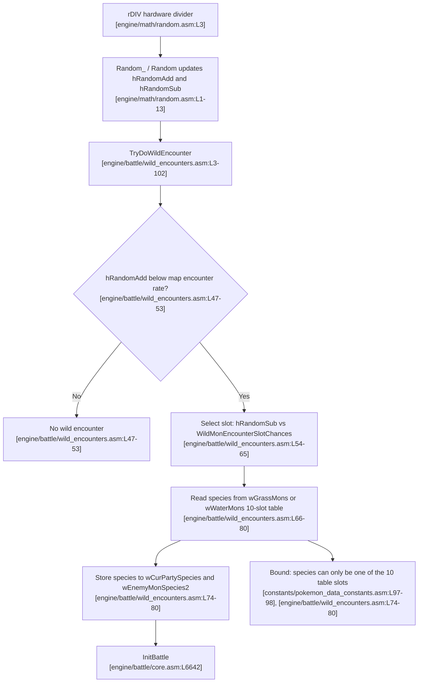
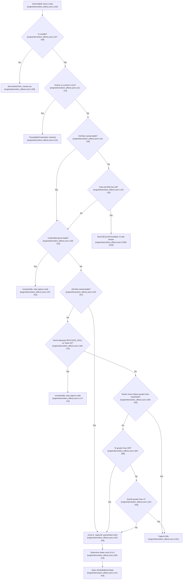

# Game mechanics reference

This chapter is the code-cited technical foundation the ten method chapters build on. It documents the shared primitives every candidate mechanism (MF-1 … MF-10) is evaluated against: the species index, the random number generator, wild-encounter generation, the catch algorithm and its guards, the battle-data and name RAM buffers, and the character codec. Each primitive is grounded in a specific line of this checkout of the pret **pokered** disassembly, so that the per-method chapters can reason about whether species `$15` (Mew) can be placed into a catchable battle or a party/box slot without re-deriving the mechanics here.

This is a neutral description of how the game works. Where a primitive happens to be the technical basis of a publicly documented glitch, that fact is noted and deferred to the [novelty verification](03-novelty-verification.md); no glitch is presented here as novel. Every sentence that asserts game behavior ends with an inline `[path:Lx-Ly]` citation, per requirement R3, and the consolidated anchor list lives in the [citation index](citation-index.md).

## Species index

- Mew's internal species index is `$15` (21 decimal), assigned by `const MEW` in the master species enumeration `[constants/pokemon_constants.asm:L30]`.

```asm
	const MEW                ; $15
```

- Every acquisition mechanism must ultimately place this one byte, `$15`, into a species field that the battle or storage code reads, so the index value is the quantity all ten method chapters are chasing `[constants/pokemon_constants.asm:L30]`.

Because `$15` is a fixed constant, "obtaining Mew" reduces to whether any input-reachable code path can write `$15` into a species field such as `wCurPartySpecies` or `wEnemyMonSpecies2` `[constants/pokemon_constants.asm:L30]`. The sections below describe every primitive that reads or writes those fields.

## Random number generation

Understanding the RNG matters because the wild-encounter check `[engine/battle/wild_encounters.asm:L47-53]` and the catch roll `[engine/items/item_effects.asm:L300-303]` both consume it.

### Core routine and entropy source

- The core generator `Random_` produces a 16-bit value and stores its two halves into the seed bytes `hRandomAdd` and `hRandomSub` `[engine/math/random.asm:L1-13]`.
- Its entropy comes from the Game Boy hardware divider register `rDIV`, which it reads directly `[engine/math/random.asm:L3]`.

```asm
	ldh a, [rDIV]
```

### Public and battle wrappers

- The public wrapper `Random` calls `Random_` and returns the `hRandomAdd` byte in the accumulator `[home/random.asm:L1-12]`.
- `BattleRandom` is the in-battle entry point; it draws from a shared pre-generated list only during link battles and otherwise falls straight through to `Random` `[engine/battle/core.asm:L6543-6548]`.

```asm
	cp LINK_STATE_BATTLING
	jp nz, Random
```

- The link-battle state it tests, `LINK_STATE_BATTLING`, is the constant `$04` `[constants/serial_constants.asm:L25]`.
- The seed bytes `hRandomAdd` and `hRandomSub` live in High RAM `[ram/hram.asm:L270-271]`.

### Determinism

- Because the output is a pure function of `rDIV` and the two seed bytes, an identical seed-and-timing state yields an identical output `[engine/math/random.asm:L1-13]`.
- This determinism is why legal input timing can influence which random value appears, yet timing can never make the RNG do anything beyond selecting among the values the consuming routine already allows, the encounter generator below being the decisive example `[engine/battle/wild_encounters.asm:L54-65]`.

## Wild-encounter generation

This is the pipeline any legitimate wild capture must traverse, and it is the crux of the whole guide: the species it can produce is strictly bounded by a fixed table. This section is referenced by [mf-1](methods/mf-1-special-stat-encounter.md) and [mf-3](methods/mf-3-rng-manipulation.md).

### Entry point

- `TryDoWildEncounter` runs the per-step encounter check and returns success in the zero flag `[engine/battle/wild_encounters.asm:L3-102]`.
- It is invoked from the battle-entry path via `callfar TryDoWildEncounter` `[engine/battle/core.asm:L6664]`.

### Encounter chance

- The map's encounter rate is compared against the `hRandomAdd` byte, and if the random byte is not below the rate no encounter occurs `[engine/battle/wild_encounters.asm:L47-53]`.

```asm
	ldh a, [hRandomAdd]
	cp b
	jr nc, .CantEncounter2
```

### Slot selection

- When an encounter passes, the `hRandomSub` byte is compared against the cumulative `WildMonEncounterSlotChances` table to choose one of the encounter slots `[engine/battle/wild_encounters.asm:L54-65]`.
- That table defines exactly 10 slots whose chances sum to 256 `[data/wild/probabilities.asm:L11-28]`.

### Species read and the bounding fact

- The chosen slot indexes into `wGrassMons` (or `wWaterMons` when the tile beneath the player is a water tile, id `$14`), and the species byte at that offset is written to `wCurPartySpecies` and `wEnemyMonSpecies2` `[engine/battle/wild_encounters.asm:L66-80]`.

```asm
	ld [wCurPartySpecies], a
	ld [wEnemyMonSpecies2], a
```

- Bounding fact: the species written can only be one of the entries already present in the current map's 10-slot table, because the code reads the byte straight out of that table with no arithmetic that could reach an out-of-table value `[engine/battle/wild_encounters.asm:L74-80]`.
- Consequently a species that is absent from every map's table, such as Mew (`$15`), can never be produced by any RNG value or any input timing through this pipeline `[engine/battle/wild_encounters.asm:L74-80]`. This single fact is what [mf-3](methods/mf-3-rng-manipulation.md) and the [conclusion](04-conclusion-and-limitations.md) rest on.

The following diagram summarizes the flow from the entropy source to battle initialization.



## Catch algorithm and guards

Once a wild Pokémon is on screen, throwing a ball runs `ItemUseBall` `[engine/items/item_effects.asm:L104]`. Every method chapter's catch step refers back to this section, which walks the guards in the order the code checks them, then the catch-rate comparison and the shake count.

### Guard sequence

`ItemUseBall` checks a fixed sequence of guards before any capture math runs `[engine/items/item_effects.asm:L104]`. In the order the code checks them:

- Out-of-battle guard: if the game is not in a battle, the routine jumps away to `ItemUseNotTime` `[engine/items/item_effects.asm:L106-109]`.
- Trainer-mon guard: balls thrown at a trainer's Pokémon divert to `ThrowBallAtTrainerMon` and cannot capture `[engine/items/item_effects.asm:L111-113]`.
- Party-and-box-full rejection: outside the Old Man tutorial the routine tests whether the party is full (`wPartyCount` equals `PARTY_LENGTH`) `[engine/items/item_effects.asm:L120-122]` and, only when it is, whether the current box is also full (`wBoxCount` equals `MONS_PER_BOX`) `[engine/items/item_effects.asm:L123-125]`; when both are full the throw is aborted to `BoxFullCannotThrowBall` and no ball is consumed `[engine/items/item_effects.asm:L2309-2310]`. `PARTY_LENGTH` is 6 and `MONS_PER_BOX` is 20 `[constants/pokemon_data_constants.asm:L58-60]`.
- Old Man full-check skip: during the Old Man tutorial battle (`wBattleType` equals 1) this party-and-box-full test is skipped, so the tutorial can always proceed `[engine/items/item_effects.asm:L115-118]`.
- Ghost-battle guard: `IsGhostBattle` is called, and an unidentified ghost is flagged uncatchable (`b = $10`) so the capture math is skipped `[engine/items/item_effects.asm:L149-153]`. The predicate `IsGhostBattle` is defined in the battle core `[engine/battle/core.asm:L3309]`.
- Old Man guaranteed capture: after the ghost check, if the battle is the Old Man tutorial the routine copies the wild-monster-data buffer and then jumps unconditionally to `.captured`, so the tutorial catch always succeeds regardless of catch rate `[engine/items/item_effects.asm:L155-164]`. Because `CopyData` copies from `hl` to `de` `[home/copy.asm:L15-16]` with `hl = wGrassRate` (source) and `de = wPlayerName` (destination), this copy is the buffer handling behind the disclosed Cinnabar/Missingno. family rather than ordinary catch logic `[engine/items/item_effects.asm:L159-164]`:

```asm
	ld hl, wGrassRate
	ld de, wPlayerName
	ld bc, NAME_LENGTH
	call CopyData
	jp .captured
```

- The genuine seed of the disclosed Cinnabar/Missingno. family is the earlier tutorial name save — `wPlayerName` copied into `wLinkEnemyTrainerName`, which shares memory with `wGrassRate` `[engine/battle/core.asm:L2030-2033]`, `[ram/wram.asm:L2144-2155]`; that data flow is analyzed and shown to be `$15`-bounded in [mf-2](methods/mf-2-cinnabar-name-buffer.md) and adjudicated in the [novelty verification](03-novelty-verification.md), not presented here as novel.
- Ghost-Marowak guard: outside the Old Man branch, on Pokémon Tower 6F an enemy of species `RESTLESS_SOUL` is likewise flagged uncatchable `[engine/items/item_effects.asm:L166-175]`.

### Capture decision

If the target is neither an uncatchable ghost nor caught automatically through the Old Man branch, the routine runs up to three tests in sequence:

- Catch-rate comparison: the adjusted random value is compared against the target's catch rate, and if `Rand1 - Status` exceeds the catch rate the throw fails immediately `[engine/items/item_effects.asm:L300-303]`.

```asm
	ld a, [wEnemyMonActualCatchRate]
	cp b
	jr c, .failedToCapture
```

- Automatic capture when `W > 255`: if the high byte of the capture quotient is nonzero the ball captures without a second random draw `[engine/items/item_effects.asm:L305-308]`.
- Second random test: otherwise a second random number `Rand2` is drawn, and if `Rand2 > X` the throw fails; otherwise the Pokémon is captured `[engine/items/item_effects.asm:L310-316]`. Success falls through to `.captured` and failure to `.failedToCapture` `[engine/items/item_effects.asm:L318-321]`.
- For Mew specifically the catch rate would be 45 `[data/pokemon/base_stats/mew.asm:L7]`; this value only matters if `$15` can first be made the enemy species, which the wild-encounter pipeline shows it cannot `[engine/battle/wild_encounters.asm:L74-80]`.

### Shake count

- Once capture or failure is decided, the number of ball shakes (0 to 3) is derived from the capture quotient by range comparisons `[engine/items/item_effects.asm:L395-412]`.
- The resulting shake and animation value is stored to `wPokeBallAnimData` `[engine/items/item_effects.asm:L414-416]`.

The following diagram models the `ItemUseBall` guard sequence and the three-stage capture decision. Each node carries the bracketed source citation for the lines that implement that step.



## Battle-data and name RAM buffers

The buffers the routines above read and write are collected here for reference.

- `wCurPartySpecies` holds the current party or encounter species byte `[ram/wram.asm:L1101]`.
- `wEnemyMon` is the enemy Pokémon battle struct populated when a battle begins `[ram/wram.asm:L1198]`.
- `wPlayerName` is the player-name buffer, reserved as `ds NAME_LENGTH` `[ram/wram.asm:L1715]`, where `NAME_LENGTH` is 11 `[constants/text_constants.asm:L3]`.
- `wGrassRate`, `wGrassMons`, `wWaterRate`, and `wWaterMons` hold the current map's wild-encounter rates and 10-slot species lists `[ram/wram.asm:L2145-2151]`.

The union of `wLinkEnemyTrainerName` with the wild-data buffer `wGrassRate` `[ram/wram.asm:L2144-2155]` is exactly what the Old Man tutorial's name save exploits to seed wild-encounter data; the full data flow is detailed in [mf-2](methods/mf-2-cinnabar-name-buffer.md).

## Character codec and name-typeability bound

The bytes a player can *type* into a name are capped by the character map, which bounds what a typed name byte can place into a species field; positions that are not typed characters instead hold indeterminate residual RAM `[constants/charmap.asm:L1]`.

- Bytes `$00` through `$17` are reserved as `TX_*` text-control codes, not typeable glyphs `[constants/charmap.asm:L1]`.
- Every name-enterable glyph is a HIGH byte: the space character is `$7f` `[constants/charmap.asm:L63]`, the letter `A` is `$80` `[constants/charmap.asm:L92]`, and the letter `Z` is `$99` `[constants/charmap.asm:L117]`; the only sub-`$7f` byte a name carries is the `"@"` terminator `$50` `[constants/charmap.asm:L12]`.
- Bound: because every typeable character encodes to a byte at or above `$7f` and the only other name byte is the `$50` terminator, while `$15` lies inside the low `$00`–`$17` control-code region, no *typed* name byte encodes to `$15` `[constants/charmap.asm:L1]`. So the species bytes a name seeds into typed positions can never be Mew's index; bytes read from positions past the copy or past the terminator are indeterminate residual — the disclosed "Missingno." state — not a typed-input lever to `$15`, which is the feasibility ceiling on the name-buffer method in [mf-2](methods/mf-2-cinnabar-name-buffer.md).
- Typed extent and presets: a custom name types at most seven characters (`PLAYER_NAME_LENGTH - 1` = 7) `[constants/text_constants.asm:L1]`, `[engine/menus/naming_screen.asm:L243-250]`, so of the five species bytes the coast reads only slots 0–2 come from typed glyphs while slots 3–9 fall past the copy into residual RAM; the three build-specific preset names are instead fully deterministic ROM data `[data/player/names_list.asm:L3-9]`. Neither route encodes `$15` — the complete byte-level enumeration is in [mf-2](methods/mf-2-cinnabar-name-buffer.md).

## Battle types

The battle-type byte `wBattleType` selects special-case behavior in the catch routine, including the Old Man party-and-box-full skip and the name restore above `[engine/items/item_effects.asm:L115-125]`.

| Constant | Value | Meaning |
|----------|-------|---------|
| `BATTLE_TYPE_NORMAL` | 0 | Ordinary wild or trainer battle |
| `BATTLE_TYPE_OLD_MAN` | 1 | The Viridian City Old Man catch tutorial |
| `BATTLE_TYPE_SAFARI` | 2 | Safari Zone battle |

- These three constants are defined together in the battle constants `[constants/battle_constants.asm:L42-44]`.
- The only one of the three set from an ordinary, input-reachable script path is the Old Man tutorial, which the Viridian City script triggers `[scripts/ViridianCity.asm:L62-83]`; that path is the subject of [mf-2](methods/mf-2-cinnabar-name-buffer.md).

## See also

- [Overview and constraints](01-overview-and-constraints.md)
- [Novelty verification](03-novelty-verification.md)
- [Glossary](glossary.md)
- [Citation index](citation-index.md)
