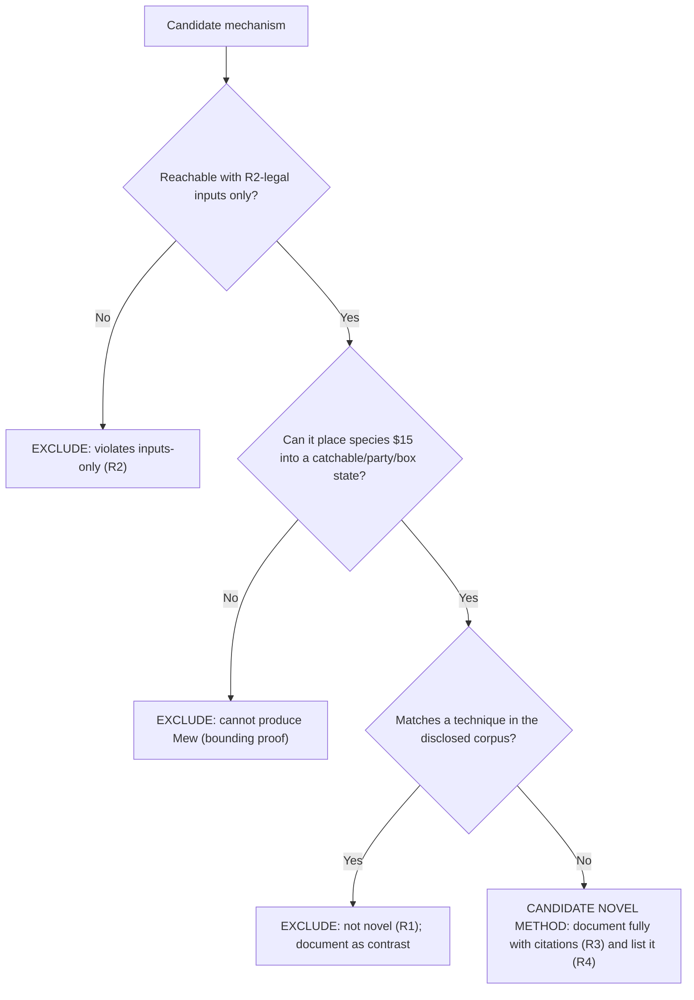

# Novelty verification

This chapter is where Requirement R1 (novelty) is enforced. It defines the adjudication methodology and the dated, bounded search protocol used across the guide, tabulates the publicly disclosed corpus of Mew-acquisition techniques as the novelty baseline, records a per-candidate verdict for every mechanism family (MF-1 … MF-7), and gives the decision tree those verdicts are derived from. The individual method chapters reference this chapter for the reasoning behind their verdicts.

## Methodology

- Every candidate mechanism family is run through the same three questions, in order; the first question it fails determines its verdict.
- Question 1 — inputs-only (R2): is the mechanism reachable using only inputs the game provides (D-pad, A / B / Start / Select, menu navigation, name and text entry, in-battle actions, timing, save and reset, and the Game Link Cable used through its normal flow)? If no, the candidate is EXCLUDED for violating the inputs-only restriction.
- Question 2 — can it produce Mew: can the mechanism place species `$15` `[constants/pokemon_constants.asm:L30]` into a catchable battle, a party slot, or a box slot? If no, the candidate is EXCLUDED by a bounding proof, because it cannot yield Mew regardless of how it is driven.
- Question 3 — novelty (R1): does the mechanism match a technique already in the publicly disclosed corpus tabulated below? If yes, it is EXCLUDED as not novel and is documented only as contrast. If no — and only if it also passed Questions 1 and 2 — it would be a candidate novel method to document fully with citations (R3) and enumerate (R4).
- A candidate is therefore labelled "novel" only when it clears all three gates: (a) it is input-reachable per R2 (Question 1), (b) it can actually place species `$15` into a catchable, party, or box state — the capability gate (Question 2) — and (c) it is absent from the public corpus per R1 (Question 3). Failing any one of the three gates disqualifies it; passing two out of three is not sufficient.
- Novelty is adjudicated against the public corpus as it stood on the search date recorded in the protocol below; this chapter makes no claim about techniques disclosed after that date, and it never fabricates an "undisclosed" method to satisfy the request.
- Source discipline (R3): claims about how the game behaves are grounded in `[path:Lx-Ly]` citations to this checkout. The external URLs in the disclosed-corpus table and search protocol are cited only as evidence that a technique is publicly known; they are never used as evidence of game behavior.

### Novelty search protocol

The R1 verdicts are reproducible. The baseline was established by the following bounded search, recorded here so a reader can repeat it.

- Search date: 2026-07-21. Novelty is adjudicated against the public corpus as it stood on this date only.
- Scope and limitation: this was a representative, bounded review of the well-known public glitch corpus for Generation-I Pokémon — not an exhaustive proof of internet-wide novelty. It establishes disclosure status only; every game-behavior claim in this guide is grounded in `[path:Lx-Ly]` citations, never in these external sources.
- Query groups run (topic keywords, not verbatim page titles):
  - Mew glitch / long-range trainer glitch / Trainer-Fly / special-encounter.
  - Ditto trick / Special-stat trick.
  - Old Man / Cinnabar-coast / name-buffer / MissingNo. encounters.
  - Arbitrary code execution (8F, "ws m", "-g m", text-box-ID matching, map-script pointer).
  - Save / SRAM corruption / 255-Pokémon glitch / expanded-party table manipulation.
  - CoolTrainer♀ / move-0x00 corruption / move-name-buffer overflow.
- Representative sources consulted, with access status verified on 2026-07-21. Bulbapedia and OCF Berkeley pages returned HTTP 200 to an automated check; Glitch City Wiki pages are human-viewable in a browser but return HTTP 403 to automated (headless) requests because of an anti-bot gate, so a 403 here indicates that gate rather than a dead link:
  - Bulbapedia — Mew glitch (`https://bulbapedia.bulbagarden.net/wiki/Mew_glitch`); Arbitrary code execution (`https://bulbapedia.bulbagarden.net/wiki/Arbitrary_code_execution`); "--" move (`https://bulbapedia.bulbagarden.net/wiki/--_(move)`); List of glitches in Generation I (`https://bulbapedia.bulbagarden.net/wiki/List_of_glitches_in_Generation_I`).
  - Glitch City Wiki — Mew trick (`https://glitchcity.wiki/wiki/Mew_trick`); Arbitrary code execution (`https://glitchcity.wiki/wiki/Arbitrary_code_execution`); Move 0x00 corruption / CoolTrainer♀ (`https://glitchcity.wiki/wiki/Move_0x00_corruption_(Generation_I)`).
  - OCF Berkeley — jdonald Mew-glitch write-up (`https://www.ocf.berkeley.edu/~jdonald/pokemon/mewglitch.html`).
  - StrategyWiki, GameFAQs, and Serebii community forums — corroborating community documentation of the above families.
- Result: every candidate mechanism family in the matrix below either matched at least one disclosed technique (failing Question 3) or failed the capability gate (Question 2). No input-reachable, Mew-capable, undisclosed method was found on the search date.

## Disclosed-corpus baseline

The following techniques for obtaining Mew are already published and therefore form the R1 exclusion baseline. The two columns are kept distinct: the game-behavior essence is grounded in `[path:Lx-Ly]` citations to this checkout (R3), while the public-disclosure column carries only precise HTTPS references establishing that the technique is publicly known. No copyrighted text is reproduced.

| # | Disclosed technique | Game-behavior essence (repository-cited) | Public disclosure (HTTPS references) |
|---|---------------------|------------------------------------------|--------------------------------------|
| 1 | Mew glitch / long-range trainer glitch (named-excluded) | An interrupted / special encounter causes the enemy-species byte read by `InitOpponent` `[engine/battle/core.asm:L6647-6650]` to be taken from battle RAM (which the glitch leaves holding 21) instead of the map's encounter table `[engine/battle/wild_encounters.asm:L74-80]`, yielding species `$15` `[constants/pokemon_constants.asm:L30]`. | `https://bulbapedia.bulbagarden.net/wiki/Mew_glitch` ; `https://glitchcity.wiki/wiki/Mew_trick` ; `https://www.ocf.berkeley.edu/~jdonald/pokemon/mewglitch.html` |
| 2 | Trainer-Fly glitch (named-excluded) | The underlying interrupted-battle state: a map trainer's engagement is started through normal movement `[home/trainers.asm:L128-159]` and then escaped, leaving the battle variables that MF-1 exploits partially initialized. | `https://bulbapedia.bulbagarden.net/wiki/Mew_glitch` ; `https://glitchcity.wiki/wiki/Trainer_escape_glitch` |
| 3 | Ditto trick / Special-stat trick | The same special-encounter primitive as row 1 — the enemy-species byte is read from RAM `[engine/battle/core.asm:L6647-6650]` — with the disclosed variant seeding the Special-stat source (value 21) via Ditto's Transform. | `https://glitchcity.wiki/wiki/Mew_trick` ; `https://bulbapedia.bulbagarden.net/wiki/Mew_glitch` |
| 4 | Arbitrary code execution (8F, "ws m", "-g m", etc.) | The item-use dispatcher computes a handler address from item data and jumps to it (`jp hl`) `[engine/items/item_effects.asm:L1-16]`, so corrupted item/RAM state can redirect execution into manipulable RAM and write Mew directly to a party or box slot. | `https://bulbapedia.bulbagarden.net/wiki/Arbitrary_code_execution` ; `https://glitchcity.wiki/wiki/Arbitrary_code_execution` |
| 5 | Save / SRAM corruption, 255-Pokémon glitch, expanded-party manipulation | Saving writes a checksummed game-data block to SRAM `[engine/menus/save.asm:L237-240]`; corrupting that persisted block or its layout `[ram/sram.asm:L12-21]` reinterprets stored party and box bytes, which disclosed variants use to inject or relabel a species. | `https://bulbapedia.bulbagarden.net/wiki/List_of_glitches_in_Generation_I` (save-corruption / 255-Pokémon sections) |
| 6 | Old Man / Cinnabar-coast name-buffer encounters | The Old Man catch tutorial copies the player's name into the wild-monster data buffers `[engine/items/item_effects.asm:L159-164]` after a normal-input trigger `[scripts/ViridianCity.asm:L62-83]`; those bytes are then read as encounter data on Cinnabar's east coast. | `https://glitchcity.wiki/wiki/Mew_trick` (old-man variant) ; `https://bulbapedia.bulbagarden.net/wiki/List_of_glitches_in_Generation_I` (old man glitch section) |
| 7 | CoolTrainer♀ / move-0x00 corruption (move-name-buffer overflow) | A name/move string is copied until the `"@"` / `$50` terminator with no length cap in the copy `[home/copy_string.asm:L7-12]`; an unterminated string staged in the 20-byte `wNameBuffer` — `NAME_BUFFER_LENGTH` is 20 `[constants/text_constants.asm:L8]` — overruns into the adjacent battle RAM it shares by `UNION` `[ram/wram.asm:L899-906]`, reinterpreting bytes such as the enemy species. | `https://glitchcity.wiki/wiki/Move_0x00_corruption_(Generation_I)` ; `https://bulbapedia.bulbagarden.net/wiki/--_(move)` ; `https://bulbapedia.bulbagarden.net/wiki/Super_Glitch_(move)` |

The only two code-level facts the public corpus independently corroborates against this checkout are Mew's internal species index `$15` `[constants/pokemon_constants.asm:L30]` and its catch rate of 45 `[data/pokemon/base_stats/mew.asm:L7]`; every other behavioral claim in this guide rests on source citations, never on the external sources above.

### Added disclosed family: move-name-buffer overflow

Requirement R4 (exhaustiveness) requires the CoolTrainer♀ / move-0x00 family (row 7) to be adjudicated, not merely listed. It is adjudicated in place here rather than in its own method chapter, because it shares the same root primitive as the other RAM-reinterpretation families and is already disclosed.

- Mechanism (repository-grounded): the Generation-I string copy runs until it reaches the `"@"` / `$50` terminator and has no length cap of its own `[home/copy_string.asm:L7-12]`. A name is staged into a fixed 20-byte buffer — `NAME_BUFFER_LENGTH` equals 20 `[constants/text_constants.asm:L8]` — and that buffer (`wNameBuffer`) shares its WRAM region, through a `UNION`, with in-battle move data `[ram/wram.asm:L899-906]`. When the staged string contains no `$50` within its first 20 bytes, the copy overruns the buffer into that adjacent battle RAM `[home/copy_string.asm:L7-12]`, which is exactly the surface the disclosed "-" / CoolTrainer♀ corruption drives to reinterpret bytes such as the enemy-species value.
- Why no separate chapter: the family is EXCLUDED under R1 (it is in the public corpus, row 7) and its overflow shares the unterminated-copy-into-battle-RAM root of the other disclosed RAM-reinterpretation entries, so it is documented as contrast rather than as a how-to.
- Inputs-only note: reaching the overflow depends on first obtaining a glitch move whose internal name is unterminated, itself a product of the disclosed glitch corpus. The copy routine `[home/copy_string.asm:L7-12]` is ordinary game code, but the precondition is not a clean-save, inputs-only path to species `$15`.

## Per-candidate verdict matrix (MF-1 … MF-7)

Each candidate mechanism family is adjudicated against the three questions from the methodology above. Every cell that asserts game behavior carries its own `[path:Lx-Ly]` citation (R3); the verdicts below match those recorded in the individual method chapters linked in the final column.

| MF | Mechanism family | Inputs-only? (R2) | Can produce `$15`? | Disclosed? (R1) | Verdict | Chapter |
|----|------------------|-------------------|--------------------|-----------------|---------|---------|
| MF-1 | Special-stat / interrupted-battle encounter | Yes — trainer engagement and battle start use normal movement and menu inputs `[home/trainers.asm:L128-159]` | Yes — the enemy species is read from a RAM byte `[engine/battle/core.asm:L6647-6650]` the glitch sets to 21 | Yes (Mew glitch / Trainer-Fly / Ditto) | EXCLUDED (disclosed) | [mf-1](methods/mf-1-special-stat-encounter.md) |
| MF-2 | Old Man / Cinnabar name-buffer | Yes — Old Man tutorial trigger and name entry are normal inputs `[scripts/ViridianCity.asm:L62-83]` | No — `$15` is a text-control code, not a typeable glyph `[constants/charmap.asm:L1,L63]`, so the name-to-wild copy `[engine/items/item_effects.asm:L159-164]` cannot place 21 | Yes (disclosed family) | EXCLUDED (disclosed + bounded) | [mf-2](methods/mf-2-cinnabar-name-buffer.md) |
| MF-3 | RNG manipulation | Yes — encounter timing seeds the RNG through the `rDIV` read in `Random_` `[engine/math/random.asm:L1-13]` | No — wild selection reads only a species present in the current map's table `[engine/battle/wild_encounters.asm:L74-80]` | n/a (bounded out before novelty) | EXCLUDED (bounding proof) | [mf-3](methods/mf-3-rng-manipulation.md) |
| MF-4 | Arbitrary code execution | Yes (in principle) — setup uses item / menu inputs, though reaching execution requires disclosed glitch state; the dispatch itself is `jp hl` `[engine/items/item_effects.asm:L1-16]` | Yes — redirected execution can write to party / box RAM `[engine/items/item_effects.asm:L1-16]` | Yes (disclosed) | EXCLUDED (disclosed) | [mf-4](methods/mf-4-arbitrary-code-execution.md) |
| MF-5 | Save / box / SRAM corruption | Partially — save and reset are legal inputs; disclosed variants add specific corruption steps `[engine/menus/save.asm:L237-240]` | Yes in disclosed variants — reinterprets persisted party / box bytes `[ram/sram.asm:L12-21]` | Yes (disclosed) | EXCLUDED (disclosed) | [mf-5](methods/mf-5-save-box-corruption.md) |
| MF-6 | Link-trade | Yes — the Game Link Cable trade runs through normal flow `[engine/link/cable_club.asm:L131-135]` | No — a trade only exchanges a party structure that already exists on a cartridge `[engine/link/cable_club.asm:L131-135]`; neither unmodified game holds Mew in any obtainable source | n/a (bounded out before novelty) | EXCLUDED — transfer-only (cannot generate or catch Mew) | [mf-6](methods/mf-6-link-trade.md) |
| MF-7 | Move-name-buffer overflow (CoolTrainer♀) | Partially — the overflow copy is ordinary code `[home/copy_string.asm:L7-12]`, but it requires a disclosed unterminated-name glitch-move precondition | Yes in disclosed use — the overrun reinterprets adjacent battle RAM, including the enemy-species byte `[ram/wram.asm:L899-906]` | Yes (CoolTrainer♀ / move-0x00 corruption) | EXCLUDED (disclosed) | [§ added family](#added-disclosed-family-move-name-buffer-overflow) |

Bottom line: no candidate clears all three gates (R2 inputs-only, the capability gate, and R1 novelty). Every input-reachable path to species `$15` falls into one of four buckets: it is table-bounded — wild selection reads only a species present in the current map's table `[engine/battle/wild_encounters.asm:L74-80]`; it is dead debug code — the routine holding the only in-ROM `db MEW` grant is "unreferenced except in _DEBUG" `[engine/debug/debug_party.asm:L15]`, so its `ELSE`-branch grant byte `db MEW, 20` `[engine/debug/debug_party.asm:L24]` is assembled into the retail build yet is never reached in normal play; it is a member of the disclosed corpus above (MF-1, MF-2, MF-4, MF-5, MF-7); or, for MF-6, it is a link trade that can only relay a Mew that already exists on some cartridge `[engine/link/cable_club.asm:L131-135]`, deferring its provenance to one of the other families. No entry in the matrix is left pending (R4), and none is presented as a novel method (R1). The full gap analysis is set out in [Conclusion and limitations](04-conclusion-and-limitations.md).

## Adjudication decision tree

The diagram below is the canonical logic every candidate is run through; the method chapters derive their verdicts from it.

## See also

- [Game mechanics reference](02-game-mechanics-reference.md)
- [Conclusion and limitations](04-conclusion-and-limitations.md)
