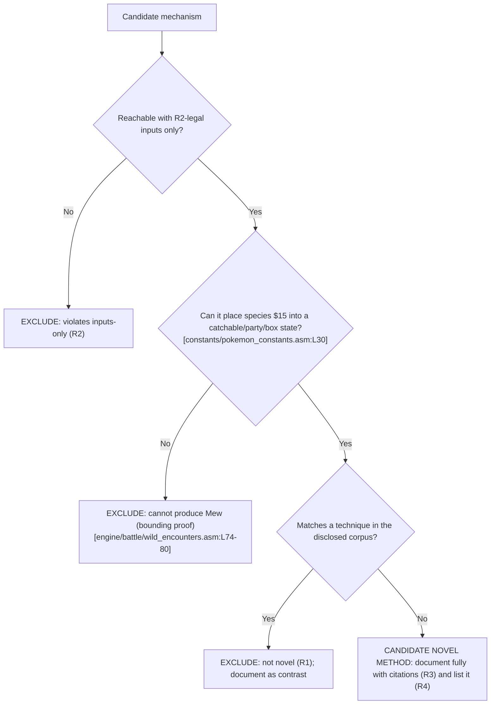

# Novelty verification

This chapter is where Requirement R1 (novelty) is enforced. It defines the adjudication methodology and the dated, bounded search protocol used across the guide, tabulates the publicly disclosed corpus of Mew-acquisition techniques as the novelty baseline, records a per-candidate verdict for every mechanism family surfaced by that bounded search (MF-1 … MF-11), and gives the decision tree those verdicts are derived from. The family set is exactly those the dated public-corpus search below surfaced; it is not asserted to be a completeness proof of the open-ended glitch space. The individual method chapters reference this chapter for the reasoning behind their verdicts.

## Methodology

- Every candidate mechanism family is run through the same three questions, in order; the first question it fails determines its verdict.
- Question 1 — inputs-only (R2): is the mechanism reachable using only inputs the game provides (D-pad, A / B / Start / Select, menu navigation, name and text entry, in-battle actions, timing, save and reset, and the Game Link Cable used through its normal flow)? If no, the candidate is EXCLUDED for violating the inputs-only restriction.
- Question 2 — can it produce Mew: can the mechanism place species `$15` `[constants/pokemon_constants.asm:L30]` into a catchable battle, a party slot, or a box slot? If no, the candidate is EXCLUDED by a bounding proof, because it cannot yield Mew regardless of how it is driven.
- Question 3 — novelty (R1): does the mechanism match a technique already in the publicly disclosed corpus tabulated below? If yes, it is EXCLUDED as not novel and is documented only as contrast. If no — and only if it also passed Questions 1 and 2 — it would be a candidate novel method to document fully with citations (R3) and enumerate (R4).
- A candidate is therefore labelled "novel" only when it clears all three gates: (a) it is input-reachable per R2 (Question 1), (b) it can actually place species `$15` into a catchable, party, or box state — the capability gate (Question 2) — and (c) it is absent from the public corpus per R1 (Question 3). Failing any one of the three gates disqualifies it; passing two out of three is not sufficient.
- Novelty is adjudicated against the public corpus as it stood on the search date recorded in the protocol below; this chapter makes no claim about techniques disclosed after that date, and it never fabricates an "undisclosed" method to satisfy the request.
- Source discipline (R3): claims about how the game behaves are grounded in `[path:Lx-Ly]` citations to this checkout. The external URLs in the disclosed-corpus table and search protocol are cited only as evidence that a technique is publicly known; they are never used as evidence of game behavior.

### Novelty search protocol

The R1 verdicts are reproducible. The baseline was established by the following bounded search, recorded here so a reader can repeat it.

- Search date: 2026-07-21. Novelty is adjudicated against the public corpus as it stood on this date only.
- Scope and limitation: this was a representative, bounded review of the well-known public glitch corpus for Generation-I Pokémon — not an exhaustive proof of internet-wide novelty. It establishes disclosure status only; every game-behavior claim in this guide is grounded in `[path:Lx-Ly]` citations, never in these external sources.
- Query groups run (topic keywords, not verbatim page titles):
  - Mew glitch / long-range trainer glitch / Trainer-Fly / special-encounter.
  - Ditto trick / Special-stat trick.
  - Old Man / Cinnabar-coast / name-buffer / MissingNo. encounters.
  - Arbitrary code execution (8F, "ws m", "-g m", text-box-ID matching, map-script pointer).
  - Save / SRAM corruption / 255-Pokémon glitch / expanded-party table manipulation.
  - CoolTrainer♀ / move-0x00 corruption / move-name-buffer overflow.
  - Remaining HP glitch / party remaining HP glitch / out-of-bounds LOL glitch (oobLG) / blockoobLG / Super-Glitch farming.
  - Fossil conversion glitch (international) / fossil conversion glitch (Japanese) / fossil-revival species corruption.
- Representative sources consulted, with access status verified on 2026-07-21. Bulbapedia and OCF Berkeley pages returned HTTP 200 to an automated check; Glitch City Wiki pages are human-viewable in a browser but return HTTP 403 to automated (headless) requests because of an anti-bot gate, so a 403 here indicates that gate rather than a dead link:
  - Bulbapedia — Mew glitch (`https://bulbapedia.bulbagarden.net/wiki/Mew_glitch`); Arbitrary code execution (`https://bulbapedia.bulbagarden.net/wiki/Arbitrary_code_execution`); "--" move (`https://bulbapedia.bulbagarden.net/wiki/--_(move)`); List of glitches in Generation I (`https://bulbapedia.bulbagarden.net/wiki/List_of_glitches_in_Generation_I`); Remaining HP glitch (`https://bulbapedia.bulbagarden.net/wiki/Remaining_HP_glitch`).
  - Glitch City Wiki — Mew trick (`https://glitchcity.wiki/wiki/Mew_trick`); Arbitrary code execution (`https://glitchcity.wiki/wiki/Arbitrary_code_execution`); Move 0x00 corruption / CoolTrainer♀ (`https://glitchcity.wiki/wiki/-_(Generation_I_move)`); out-of-bounds LOL glitch and blockoobLG (`https://glitchcity.wiki/wiki/OobLG`); party remaining HP glitch (`https://glitchcity.wiki/wiki/Party_remaining_HP_glitch`).
  - OCF Berkeley — WhiteCat's Mew-glitch guide, mirrored on jdonald's OCF account (`https://www.ocf.berkeley.edu/~jdonald/pokemon/mewglitch.html`). The page itself credits WhiteCat (originally hosted at `pokedex.kary.ca`) and points readers to TheScythe's more detailed Mew-glitch FAQ on the GameFAQs Pokémon Red/Blue board; jdonald's OCF account is the mirror host, not the author.
- Result: every candidate mechanism family in the matrix below either matched at least one disclosed technique (failing Question 3) or failed the capability gate (Question 2). No input-reachable, Mew-capable, undisclosed method was found on the search date.

## Disclosed-corpus baseline

The following techniques for obtaining Mew are already published and therefore form the R1 exclusion baseline. The two columns are kept distinct: the game-behavior essence is grounded in `[path:Lx-Ly]` citations to this checkout (R3), while the public-disclosure column carries only precise HTTPS references establishing that the technique is publicly known. No copyrighted text is reproduced.

| # | Disclosed technique | Game-behavior essence (repository-cited) | Public disclosure (HTTPS references) |
|---|---------------------|------------------------------------------|--------------------------------------|
| 1 | Mew glitch / long-range trainer glitch (named-excluded) | What the cited code proves is only the read path: `InitOpponent` copies the enemy-species value out of the RAM byte `wCurOpponent` into `wCurPartySpecies` / `wEnemyMonSpecies2` `[engine/battle/core.asm:L6647-6650]` rather than from the map's encounter table `[engine/battle/wild_encounters.asm:L74-80]`. The disclosed technique is what arranges for that RAM source to hold 21, so the copied species becomes `$15` `[constants/pokemon_constants.asm:L30]`. | `https://bulbapedia.bulbagarden.net/wiki/Mew_glitch` ; `https://glitchcity.wiki/wiki/Mew_trick` ; `https://www.ocf.berkeley.edu/~jdonald/pokemon/mewglitch.html` |
| 2 | Trainer-Fly glitch (named-excluded) | The underlying interrupted-battle state: a map trainer's engagement is started through normal movement `[home/trainers.asm:L128-159]` and then escaped, leaving the battle variables that MF-1 exploits partially initialized. | `https://bulbapedia.bulbagarden.net/wiki/Mew_glitch` ; `https://glitchcity.wiki/wiki/Trainer_escape_glitch` |
| 3 | Ditto trick / Special-stat trick | The same special-encounter primitive as row 1 — the enemy-species byte is read from RAM `[engine/battle/core.asm:L6647-6650]` — with the disclosed variant seeding the Special-stat source (value 21) via Ditto's Transform. | `https://glitchcity.wiki/wiki/Mew_trick` ; `https://bulbapedia.bulbagarden.net/wiki/Mew_glitch` |
| 4 | Arbitrary code execution (8F, "ws m", "-g m", etc.) | What the cited code proves is the dispatch primitive: the item-use handler computes a handler address from item data and transfers control to it with a computed `jp hl` `[engine/items/item_effects.asm:L1-16]`. That computed indirect jump is the primitive the disclosed ACE techniques redirect — steering execution into manipulable RAM to write a species directly to a party or box slot — rather than a behavior of the cited lines themselves. | `https://bulbapedia.bulbagarden.net/wiki/Arbitrary_code_execution` ; `https://glitchcity.wiki/wiki/Arbitrary_code_execution` |
| 5 | Save / SRAM corruption, 255-Pokémon glitch, expanded-party manipulation | What the cited code proves is that saving computes a checksum over the game-data block and writes it to SRAM `[engine/menus/save.asm:L237-240]`, and that this block has a fixed SRAM layout `[ram/sram.asm:L12-21]`. Disclosed save / SRAM-corruption variants perturb that persisted block or its layout so the stored party and box bytes are reinterpreted, injecting or relabelling a species; that corruption step is the disclosed technique, not a behavior of the cited lines. | `https://bulbapedia.bulbagarden.net/wiki/List_of_glitches_in_Generation_I` (save-corruption / 255-Pokémon sections) |
| 6 | Old Man / Cinnabar-coast name-buffer encounters | The Old Man catch tutorial seeds the player's name into the wild-monster data buffers because `wLinkEnemyTrainerName` shares the `wGrassRate` / `wGrassMons` union `[engine/battle/core.asm:L2030-2033]`, after a normal-input trigger `[scripts/ViridianCity.asm:L62-83]`; on Cinnabar's east coast those leftover bytes are then read as encounter data `[engine/battle/wild_encounters.asm:L75-78]`. The later Old Man ball copy runs the reverse direction, restoring the name from the buffer `[engine/items/item_effects.asm:L159-164]`. | `https://glitchcity.wiki/wiki/Mew_trick` (old-man variant) ; `https://bulbapedia.bulbagarden.net/wiki/List_of_glitches_in_Generation_I` (old man glitch section) |
| 7 | CoolTrainer♀ / move-0x00 corruption (move-name-buffer overflow) | `FormatMovesString` stages each move's name into the fixed 20-byte `wNameBuffer` through `GetName` `[home/names2.asm:L86-88]` — `NAME_BUFFER_LENGTH` is 20 `[constants/text_constants.asm:L8]` — then copies characters out of it into `wMovesString` until a `"@"`, with no length cap on that copy `[engine/battle/misc.asm:L17-24]`; a name lacking `"@"` overruns the shared-`UNION` staging RAM `[ram/wram.asm:L899-906]` and the region past `wMovesString` `[ram/wram.asm:L1563]`. | `https://glitchcity.wiki/wiki/-_(Generation_I_move)` ; `https://bulbapedia.bulbagarden.net/wiki/--_(move)` ; `https://bulbapedia.bulbagarden.net/wiki/Super_Glitch` |
| 8 | Remaining HP glitch (party remaining HP glitch) | What the cited code proves is only that a catch-rate-255 target is a guaranteed capture — the Ball's "W > 255" branch captures unconditionally `[engine/items/item_effects.asm:L305-308]` — and that `$15` is Mew's index `[constants/pokemon_constants.asm:L30]`. The disclosed technique reinterprets a party Pokémon's remaining-HP byte as a species index through box deposit / withdraw reordering `[engine/pokemon/bills_pc.asm:L207]` `[engine/pokemon/bills_pc.asm:L256]`; that HP-to-species reinterpretation is the disclosed step, not a behavior of the cited lines. | `https://bulbapedia.bulbagarden.net/wiki/Remaining_HP_glitch` ; `https://glitchcity.wiki/wiki/Party_remaining_HP_glitch` |
| 9 | Out-of-bounds LOL glitch (oobLG) | What the cited code proves is only how the opponent-species byte is consumed once set: `InitOpponent` copies it into `wEnemyMonSpecies2` `[engine/battle/core.asm:L6647-6650]` and the setup treats values below `OPP_ID_OFFSET` (200) `[constants/trainer_constants.asm:L1]` as a wild encounter `[engine/battle/core.asm:L6674-6676]`. The disclosed technique writes that byte from a fixed screen tile that cannot span the control-character range containing `$15` `[constants/charmap.asm:L1]`; the out-of-bounds write and its `7C`-tile bound are the disclosed technique, not a behavior of the cited lines. | `https://glitchcity.wiki/wiki/OobLG` ; `https://bulbapedia.bulbagarden.net/wiki/List_of_glitches_in_Generation_I` |
| 10 | Block out-of-bounds LOL glitch (blockoobLG) | Same consumption primitive as row 9 — `InitOpponent` reads the opponent-species byte `[engine/battle/core.asm:L6647-6650]` and the 200-split routes low indices to a wild battle `[engine/battle/core.asm:L6674-6676]`. The disclosed variant writes that byte from an alternate source that can reach control-character indices `[constants/charmap.asm:L1]`, so it can set `$15` `[constants/pokemon_constants.asm:L30]`; that differential write is the disclosed technique, not a behavior of the cited lines. | `https://glitchcity.wiki/wiki/OobLG` (blockoobLG variant) |
| 11 | International fossil conversion glitch (English adaptation of the Japanese fossil conversion glitch) | What the cited code proves is only the ordinary revival data-flow: the Cinnabar lab stores the chosen fossil's species to `wFossilMon` `[engine/events/cinnabar_lab.asm:L52-53]` `[ram/wram.asm:L2065]`, and the hand-over script passes that byte straight to `GivePokemon`, which writes it into `wCurPartySpecies` `[scripts/CinnabarLabFossilRoom.asm:L77-80]` `[home/give.asm:L18-21]` with no fossil-species validation. The disclosed technique corrupts `wFossilMon` (in the English adaptation, from a swapped Pokémon's Attack stat modulo 256, so an Attack of 21 selects `$15` `[constants/pokemon_constants.asm:L30]`) before the fossil is received; that corruption is the disclosed step, not a behavior of the cited lines. | `https://glitchcity.wiki/wiki/International_fossil_conversion_glitch` ; `https://glitchcity.wiki/wiki/Fossil_conversion_glitch_(Japanese)` ; `https://glitchcity.wiki/wiki/List_of_exploits_to_obtain_Mew` |

The only two code-level facts the public corpus independently corroborates against this checkout are Mew's internal species index `$15` `[constants/pokemon_constants.asm:L30]` and its catch rate of 45 `[data/pokemon/base_stats/mew.asm:L7]`; every other behavioral claim in this guide rests on source citations, never on the external sources above.

### Added disclosed families: Super-Glitch / unterminated-name relatives

Requirement R4 (exhaustiveness) requires that every family the bounded search surfaced be adjudicated, not merely listed. Beyond rows 1–6, the search surfaced four related disclosed families — the CoolTrainer♀ / move-0x00 move-name-buffer overflow (row 7) and three Super-Glitch / unterminated-name relatives (rows 8–10) — each adjudicated in full in its own method chapter and summarized below.

- MF-7 — move-name-buffer overflow. Mechanism (repository-grounded): `FormatMovesString` stages each move's name into the fixed 20-byte `wNameBuffer` through `GetName` `[home/names2.asm:L86-88]` — `NAME_BUFFER_LENGTH` equals 20 `[constants/text_constants.asm:L8]` — then copies characters out of it into `wMovesString` until a `"@"`, with no length cap on that copy `[engine/battle/misc.asm:L17-24]`. When the staged name contains no `"@"`, the copy over-reads past `wNameBuffer`, which shares its WRAM region by `UNION` with in-battle move data `[ram/wram.asm:L899-906]`, and over-writes past `wMovesString` `[ram/wram.asm:L1563]` — the surface the disclosed "-" / CoolTrainer♀ corruption drives. Verdict: EXCLUDED under R1 as a disclosed technique (row 7). It is input-reachable under R2 — the formatter is ordinary code reached on every battle turn `[engine/battle/misc.asm:L2]`, and the disclosed corpus documents a controller-only route to the prerequisite unterminated-name glitch move (external disclosure metadata) — so the family is not "partially" reachable; it is input-reachable but disclosed. Its full inputs-only treatment, including the note that the overrun does not itself rewrite the enemy-species byte, is in [MF-7](methods/mf-7-move-name-buffer-overflow.md).
- MF-8 — remaining HP glitch. Repository-grounded facts: a catch-rate-255 base capture is guaranteed by the Ball's "W > 255" branch `[engine/items/item_effects.asm:L305-308]`, and `$15` is Mew's index `[constants/pokemon_constants.asm:L30]`. The HP-byte-as-species reinterpretation through box reordering is disclosed (external metadata). Verdict: EXCLUDED under R1; it can produce `$15`, so it is excluded on novelty, not capability. Full treatment in [MF-8](methods/mf-8-remaining-hp-glitch.md).
- MF-9 — out-of-bounds LOL glitch (oobLG). Repository-grounded facts: once set, the opponent-species byte is read by `InitOpponent` `[engine/battle/core.asm:L6647-6650]` and range-split at 200 `[engine/battle/core.asm:L6674-6676]`. The disclosed write is bounded by a fixed screen tile and cannot reach the control-character range that contains `$15` `[constants/charmap.asm:L1]`. Verdict: EXCLUDED under R1 and additionally bounded — plain oobLG cannot produce `$15`. Full treatment in [MF-9](methods/mf-9-out-of-bounds-lol-glitch.md).
- MF-10 — block out-of-bounds LOL glitch (blockoobLG). Repository-grounded facts: same read `[engine/battle/core.asm:L6647-6650]` and 200-split `[engine/battle/core.asm:L6674-6676]`; the disclosed variant's alternate write source reaches control-character indices `[constants/charmap.asm:L1]`, so it can set `$15` `[constants/pokemon_constants.asm:L30]`. Verdict: EXCLUDED under R1; it can produce `$15`, so it is excluded on novelty, not capability. Full treatment in [MF-10](methods/mf-10-blockooblg.md).

### Added disclosed family: international fossil conversion

The same bounded search also surfaced a select-glitch family unrelated to the move- and name-buffer overflows above — the international fossil conversion glitch (row 11) — adjudicated in full in its own method chapter and summarized here.

- MF-11 — international fossil conversion glitch. Repository-grounded facts: the Cinnabar lab stores the chosen fossil's species to `wFossilMon` `[engine/events/cinnabar_lab.asm:L52-53]` `[ram/wram.asm:L2065]`, and the fossil-room hand-over script passes that byte straight to `GivePokemon`, which writes it into `wCurPartySpecies` with no fossil-species validation `[scripts/CinnabarLabFossilRoom.asm:L77-80]` `[home/give.asm:L18-21]`. The disclosed corruption of `wFossilMon` to `$15` `[constants/pokemon_constants.asm:L30]` — in the English adaptation, from a swapped Pokémon's Attack stat modulo 256 — is external disclosure metadata. Verdict: EXCLUDED under R1; it can produce `$15`, so it is excluded on novelty, not capability. Full treatment in [MF-11](methods/mf-11-fossil-conversion.md).

## Per-candidate verdict matrix (MF-1 … MF-11)

Each candidate mechanism family is adjudicated against the three questions from the methodology above. Every cell that asserts game behavior carries its own `[path:Lx-Ly]` citation (R3); the verdicts below match those recorded in the individual method chapters linked in the final column.

| MF | Mechanism family | Inputs-only? (R2) | Can produce `$15`? | Disclosed? (R1) | Verdict | Chapter |
|----|------------------|-------------------|--------------------|-----------------|---------|---------|
| MF-1 | Special-stat / interrupted-battle encounter | Yes — trainer engagement and battle start use normal movement and menu inputs `[home/trainers.asm:L128-159]` | Yes in disclosed use — the enemy species is copied from the RAM value `wCurOpponent` `[engine/battle/core.asm:L6647-6650]`, which the disclosed glitch arranges to hold 21 | Yes (Mew glitch / Trainer-Fly / Ditto) | EXCLUDED (disclosed) | [mf-1](methods/mf-1-special-stat-encounter.md) |
| MF-2 | Old Man / Cinnabar name-buffer | Yes — Old Man tutorial trigger and name entry are normal inputs `[scripts/ViridianCity.asm:L62-83]` | No via typed input — `$15` is a `$00`–`$17` text-control code `[constants/charmap.asm:L1]`, neither a typeable glyph at or above `$7f` `[constants/charmap.asm:L63]` nor the `$50` terminator, so the name seeded into the wild buffer `[engine/battle/core.asm:L2030-2033]` cannot encode 21 in a typed position. A custom name types at most seven characters `[engine/menus/naming_screen.asm:L243-250]`, so only slots 0–2 are typed while slots 3–9 hold disclosed indeterminate residual, and the three build-specific preset names are deterministic ROM data that likewise contain no `$15` `[data/player/names_list.asm:L3-9]` | Yes (disclosed family) | EXCLUDED (disclosed + bounded) | [mf-2](methods/mf-2-cinnabar-name-buffer.md) |
| MF-3 | RNG manipulation | Yes — encounter timing seeds the RNG through the `rDIV` read in `Random_` `[engine/math/random.asm:L1-13]` | No — wild selection reads only a species present in the current map's table `[engine/battle/wild_encounters.asm:L74-80]` | n/a (bounded out before novelty) | EXCLUDED (bounding proof) | [mf-3](methods/mf-3-rng-manipulation.md) |
| MF-4 | Arbitrary code execution | Yes (in principle) — setup uses item / menu inputs, though reaching execution requires disclosed glitch state; the dispatch itself is `jp hl` `[engine/items/item_effects.asm:L1-16]` | Yes in disclosed use — the computed `jp hl` dispatch `[engine/items/item_effects.asm:L1-16]` is the primitive disclosed ACE redirects to write a species to party / box RAM | Yes (disclosed) | EXCLUDED (disclosed) | [mf-4](methods/mf-4-arbitrary-code-execution.md) |
| MF-5 | Save / box / SRAM corruption | Partially — save and reset are legal inputs; disclosed variants add specific corruption steps `[engine/menus/save.asm:L237-240]` | Yes in disclosed variants — disclosed corruption reinterprets the persisted party / box bytes in the fixed SRAM game-data block `[ram/sram.asm:L12-21]` | Yes (disclosed) | EXCLUDED (disclosed) | [mf-5](methods/mf-5-save-box-corruption.md) |
| MF-6 | Link-trade | Yes — the Game Link Cable trade runs through normal flow `[engine/link/cable_club.asm:L131-135]` | No — a trade only exchanges a party structure that already exists on a cartridge `[engine/link/cable_club.asm:L131-135]`; neither unmodified game holds Mew in any obtainable source | n/a (bounded out before novelty) | EXCLUDED — transfer-only (cannot generate or catch Mew) | [mf-6](methods/mf-6-link-trade.md) |
| MF-7 | Move-name-buffer overflow (CoolTrainer♀) | Yes (controller-only, not ordinary play) — the formatter copy is ordinary code reached every battle turn `[engine/battle/misc.asm:L17-24]`, and the disclosed corpus documents a controller-only route to the prerequisite unterminated-name glitch move | Yes in disclosed use — an unterminated name overruns the shared-`UNION` staging RAM `[ram/wram.asm:L899-906]` and the region past `wMovesString` `[ram/wram.asm:L1563]` | Yes (CoolTrainer♀ / move-0x00 corruption) | EXCLUDED (disclosed) | [mf-7](methods/mf-7-move-name-buffer-overflow.md) |
| MF-8 | Remaining HP glitch | Yes (controller-only, not ordinary play) — box deposit / withdraw and HP reduction are legal inputs; the guaranteed base capture is the Ball's "W > 255" branch `[engine/items/item_effects.asm:L305-308]` | Yes — the disclosed HP-byte-as-species reinterpretation can yield any index including `$15` `[constants/pokemon_constants.asm:L30]` | Yes (remaining HP glitch) | EXCLUDED (disclosed) | [mf-8](methods/mf-8-remaining-hp-glitch.md) |
| MF-9 | Out-of-bounds LOL glitch (oobLG) | Yes (controller-only, not ordinary play) — the resulting opponent-species byte is read by `InitOpponent` `[engine/battle/core.asm:L6647-6650]` and range-split at 200 `[engine/battle/core.asm:L6674-6676]` | No — the disclosed write is bounded by a fixed screen tile and cannot reach the control-character range containing `$15` `[constants/charmap.asm:L1]` | Yes (oobLG) | EXCLUDED (disclosed + bounded) | [mf-9](methods/mf-9-out-of-bounds-lol-glitch.md) |
| MF-10 | Block out-of-bounds LOL glitch (blockoobLG) | Yes (controller-only, not ordinary play) — the resulting opponent-species byte is read by `InitOpponent` `[engine/battle/core.asm:L6647-6650]` and range-split at 200 `[engine/battle/core.asm:L6674-6676]` | Yes — the disclosed variant's alternate write reaches control-character indices `[constants/charmap.asm:L1]`, so it can set `$15` `[constants/pokemon_constants.asm:L30]` | Yes (blockoobLG) | EXCLUDED (disclosed) | [mf-10](methods/mf-10-blockooblg.md) |
| MF-11 | International fossil conversion glitch | Yes (controller-only, not ordinary play) — the fossil-room hand-over passes `wFossilMon` straight to `GivePokemon` with no validation `[scripts/CinnabarLabFossilRoom.asm:L77-80]` `[home/give.asm:L18-21]` | Yes — `GivePokemon` grants whatever byte `wFossilMon` holds, and the disclosed corruption sets it to `$15` `[ram/wram.asm:L2065]` `[constants/pokemon_constants.asm:L30]` | Yes (international / Japanese fossil conversion glitch) | EXCLUDED (disclosed) | [mf-11](methods/mf-11-fossil-conversion.md) |

Bottom line: no candidate clears all three gates (R2 inputs-only, the capability gate, and R1 novelty). Every input-reachable path to species `$15` that this bounded search surfaced falls into one of four buckets: it is table-bounded — wild selection reads only a species present in the current map's table `[engine/battle/wild_encounters.asm:L74-80]`; it is dead debug code — the routine holding the only in-ROM `db MEW` grant is "unreferenced except in _DEBUG" `[engine/debug/debug_party.asm:L15]`, so its `ELSE`-branch grant byte `db MEW, 20` `[engine/debug/debug_party.asm:L24]` is assembled into the retail build yet is never reached in normal play; it is a member of the disclosed corpus above (MF-1, MF-2, MF-4, MF-5, MF-7, MF-8, MF-9, MF-10, MF-11); or, for MF-6, it is a link trade that can only relay a Mew that already exists on some cartridge `[engine/link/cable_club.asm:L131-135]`, deferring its provenance to one of the other families. No entry in the matrix is left pending (R4), and none is presented as a novel method (R1); the enumeration is exactly the families this dated, bounded public-corpus search surfaced, not a completeness proof of the open-ended glitch space. The full gap analysis is set out in [Conclusion and limitations](04-conclusion-and-limitations.md).

## Adjudication decision tree

The diagram below is the canonical logic every candidate is run through; the method chapters derive their verdicts from it.

## See also

- [Game mechanics reference](02-game-mechanics-reference.md)
- [Conclusion and limitations](04-conclusion-and-limitations.md)
