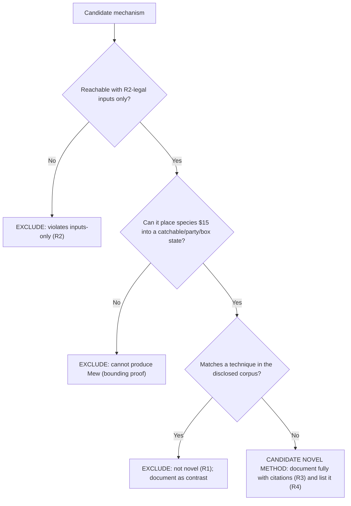

# Novelty verification

This chapter is where Requirement R1 (novelty) is enforced. It defines the adjudication methodology used across the guide, tabulates the publicly disclosed corpus of Mew-acquisition techniques as the novelty baseline, records a per-candidate verdict for every mechanism family (MF-1 … MF-6), and gives the decision tree those verdicts are derived from. The individual method chapters reference this chapter for the reasoning behind their verdicts.

## Methodology

- Every candidate mechanism family is run through the same three questions, in order; the first question it fails determines its verdict.
- Question 1 — inputs-only (R2): is the mechanism reachable using only inputs the game provides (D-pad, A / B / Start / Select, menu navigation, name and text entry, in-battle actions, timing, save and reset, and the Game Link Cable used through its normal flow)? If no, the candidate is EXCLUDED for violating the inputs-only restriction.
- Question 2 — can it produce Mew: can the mechanism place species `$15` `[constants/pokemon_constants.asm:L30]` into a catchable battle, a party slot, or a box slot? If no, the candidate is EXCLUDED by a bounding proof, because it cannot yield Mew regardless of how it is driven.
- Question 3 — novelty (R1): does the mechanism match a technique already in the publicly disclosed corpus tabulated below? If yes, it is EXCLUDED as not novel and is documented only as contrast. If no — and only if it also passed Questions 1 and 2 — it would be a candidate novel method to document fully with citations (R3) and enumerate (R4).
- A candidate is therefore labelled "novel" only when it is both (a) input-reachable per R2 and (b) absent from the public corpus.
- Novelty is adjudicated against that corpus as it stood at authoring time; this chapter makes no claim about techniques disclosed afterward, and it never fabricates an "undisclosed" method to satisfy the request.
- Source discipline (R3): claims about how the game behaves are grounded in `[path:Lx-Ly]` citations to this checkout. The external URLs in the disclosed-corpus table are cited only as evidence that a technique is publicly known; they are never used as evidence of game behavior.

## Disclosed-corpus baseline

The following techniques for obtaining Mew are already published and therefore form the R1 exclusion baseline. Only short factual essences and bare source domains are listed as metadata; no copyrighted text is reproduced.

| # | Disclosed technique | Essence (1 line) | Public sources (metadata) |
|---|---------------------|------------------|---------------------------|
| 1 | Mew glitch / long-range trainer glitch (named-excluded) | A special encounter reads the last-battled Pokémon's Special stat (21) as the wild-species index, yielding Mew | bulbapedia.bulbagarden.net, strategywiki.org, gamefaqs.gamespot.com, ocf.berkeley.edu/~jdonald/pokemon/mewglitch.html |
| 2 | Trainer-Fly glitch (named-excluded) | The underlying interrupted-battle glitch that the Mew glitch extends | bulbapedia.bulbagarden.net |
| 3 | Ditto trick / Special-stat trick | Ditto transforms to copy a Special-21 Pokémon, then the special encounter fires | forums.serebii.net, glitchcity.wiki |
| 4 | Arbitrary code execution (8F, ws m, -g m, etc.) | Redirect the program counter into manipulable RAM to write Mew directly to a party or box slot | bulbapedia.bulbagarden.net, glitchcity.wiki |
| 5 | Save / SRAM corruption, 255-Pokémon glitch, expanded-party manipulation | Corrupt persistent state to inject or reinterpret party and box data | glitchcity.wiki |
| 6 | Old Man / Cinnabar-coast name-buffer encounters | Player-name bytes are read as wild-encounter data on Cinnabar's east coast | glitchcity.wiki, strategywiki.org |

The only two code-level facts the public corpus independently corroborates against this checkout are Mew's internal species index `$15` `[constants/pokemon_constants.asm:L30]` and its catch rate of 45 `[data/pokemon/base_stats/mew.asm:L7]`; every other behavioral claim in this guide rests on source citations, never on the external sources above.

## Per-candidate verdict matrix (MF-1 … MF-6)

Each candidate mechanism family is adjudicated against the three questions from the methodology above. The verdicts below are those recorded in the individual method chapters linked in the final column.

| MF | Mechanism family | Inputs-only? (R2) | Can produce `$15`? | Disclosed? (R1) | Verdict | Chapter |
|----|------------------|-------------------|--------------------|-----------------|---------|---------|
| MF-1 | Special-stat / interrupted-battle encounter | Yes | Yes (this is how the disclosed glitch works) | Yes (Mew glitch / Trainer-Fly / Ditto) | EXCLUDED (disclosed) | [mf-1](methods/mf-1-special-stat-encounter.md) |
| MF-2 | Old Man / Cinnabar name-buffer | Yes | No (`$15` is not typeable) | Yes (disclosed family) | EXCLUDED (disclosed + bounded) | [mf-2](methods/mf-2-cinnabar-name-buffer.md) |
| MF-3 | RNG manipulation | Yes (timing is legal) | No (table-bounded) | n/a | EXCLUDED (bounding proof) | [mf-3](methods/mf-3-rng-manipulation.md) |
| MF-4 | Arbitrary code execution | Yes (in principle) | Yes | Yes (disclosed) | EXCLUDED (disclosed) | [mf-4](methods/mf-4-arbitrary-code-execution.md) |
| MF-5 | Save / box / SRAM corruption | Partially (inputs can corrupt) | Yes (in disclosed variants) | Yes (disclosed) | EXCLUDED (disclosed) | [mf-5](methods/mf-5-save-box-corruption.md) |
| MF-6 | Link-trade | Yes | No (no Mew on either cartridge) | n/a | IMPOSSIBLE | [mf-6](methods/mf-6-link-trade.md) |

Bottom line: no candidate passes all three gates. Every input-reachable path to species `$15` is either table-bounded (wild selection reads only a species present in the current map's table `[engine/battle/wild_encounters.asm:L74-80]`), dead debug code (the sole in-ROM `db MEW` grant lives in `DebugNewGameParty`, which is "unreferenced except in _DEBUG" `[engine/debug/debug_party.asm:L15-24]`), or a member of the disclosed corpus above. No entry in the matrix is left pending (R4), and none is presented as a novel method (R1). The full gap analysis is set out in [Conclusion and limitations](04-conclusion-and-limitations.md).

## Adjudication decision tree

The diagram below is the canonical logic every candidate is run through; the method chapters derive their verdicts from it.

## See also

- [Game mechanics reference](02-game-mechanics-reference.md)
- [Conclusion and limitations](04-conclusion-and-limitations.md)
