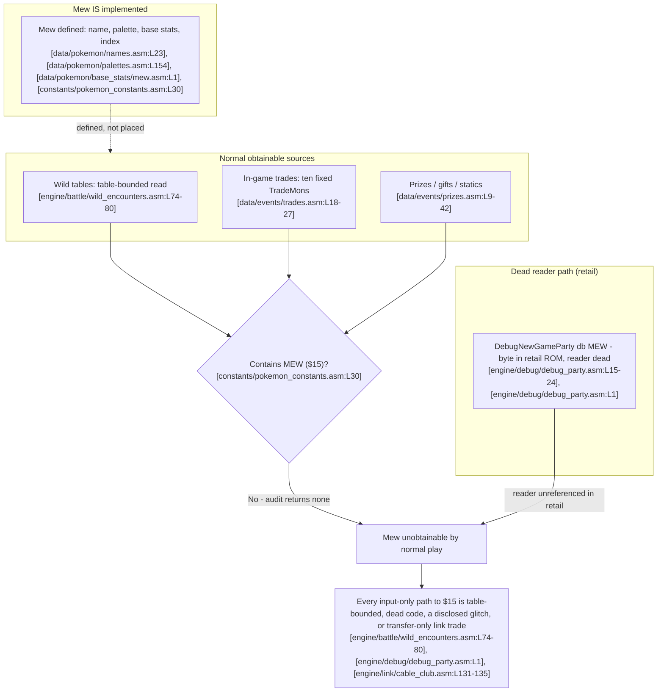

# Conclusion and limitations

This is the payoff chapter of the guide, and its value is the rigor of a negative result rather than the disclosure of a trick. The analysis in the preceding chapters converges on a single finding: Mew is fully implemented in the pret **pokered** disassembly, yet across every obtainable source audited in this checkout it is placed in no location that normal play can reach, so every input-only path to species `$15` falls into one of four buckets — table-bounded `[engine/battle/wild_encounters.asm:L74-80]`, dead debug code whose reader is unreferenced in retail `[engine/debug/debug_party.asm:L1]`, a member of the already-disclosed glitch corpus `[constants/pokemon_constants.asm:L30]`, or a transfer-only link trade that can only relay a Mew already present on another cartridge `[engine/link/cable_club.asm:L131-135]`. As with every other chapter, each sentence that asserts game behavior ends with a `[path:Lx-Ly]` citation into this checkout, and the consolidated anchor list lives in the [citation index](citation-index.md).

## Gap analysis: implemented but unplaced

Mew is a fully specified species. It has a name, `dname "MEW"` `[data/pokemon/names.asm:L23]`; a palette, `db PAL_MEWMON ; MEW` `[data/pokemon/palettes.asm:L154]`; a complete base-stats entry beginning `db DEX_MEW` `[data/pokemon/base_stats/mew.asm:L1]` with a catch rate of 45 `[data/pokemon/base_stats/mew.asm:L7]`; and a reserved species index, `const MEW ; $15` `[constants/pokemon_constants.asm:L30]`. By every measure of definition, the game knows what Mew is.

What the game lacks is any *placement* of that species into a source a player can reach. The distinction between a definition and a placement is the crux of this chapter: a definition tells the engine how to render and simulate species `$15` once it is the current species, whereas a placement is what writes `$15` into a species field through normal play `[constants/pokemon_constants.asm:L30]`. Two routines that mention `MEW` are easily mistaken for placements but are in fact only *loaders*. The graphics-bank selector compares the current species against `MEW` to route Mew's sprite to bank `$1` `[home/pics.asm:L11-23]`, and the base-stats loader special-cases `MEW` with `cp MEW` / `jr z, .mew` to read its stats `[home/pokemon.asm:L399-400]`. Both run only *if Mew is already the current species*; they route data, they do not introduce Mew. Their special-casing is consistent with Mew being handled apart from the main roster `[home/pics.asm:L11-23]`, and the disassembly records that chronology directly in its own source note, which explains that Mew's pics and base data are grouped separately from the other Pokémon because it was a last-minute addition `[data/pokemon/mew.asm:L1-9]`. The Pokémon Mansion journals likewise mention Mew as flavor narrative — "newly discovered #MON, MEW" `[text/PokemonMansion2F.asm:L31-32]` and "MEW gave birth" `[text/PokemonMansion3F.asm:L33]` — which is story text, not a species placement.

The audit is reproducible. It was run at commit `242373f4` over the source directories `constants/ data/ engine/ home/ ram/ scripts/ maps/ text/ audio/ gfx/`, restricted to `*.asm` and `*.inc` files, and it categorizes every `MEW` occurrence by case and word boundary. The exact commands and their results at this checkout are:

- Exact whole-word `MEW`, case-sensitive, `MEWTWO` excluded — `grep -rnw --include='*.asm' --include='*.inc' 'MEW' <dirs> | grep -v MEWTWO` — returns **10** occurrences.
- Case-insensitive whole-word `mew`, `mewtwo` excluded — `grep -rniw --include='*.asm' --include='*.inc' 'mew' <dirs> | grep -vi mewtwo` — returns **23** (the 10 above plus 13 lowercase or mixed-case whole-word hits, all of them prose comments, source notes, or flavor text such as a `; discount Mew` Pokédex-count comment and a `"Mew!@"` NPC line).
- Case-insensitive substring `mew`, `mewtwo` excluded — `grep -rni --include='*.asm' --include='*.inc' 'mew' <dirs> | grep -vi mewtwo` — returns **71** (the 23 above plus 48 implementation-artifact substrings such as `DEX_MEW`, `PAL_MEWMON`, `MewPicFront`, and the cry/icon symbols).

The word "exhaustive" here is bounded to those audited repository surfaces at this checkout, not to a claim about every possible build configuration. Not one of the 10 exact-`MEW` occurrences — and none of the wider 23 or 71 — is a *placement* of species `$15` into an obtainable source `[constants/pokemon_constants.asm:L30]`; the categorization table below records the exact occurrences alongside the base-stats definition and the principal obtainable surfaces, classifying each as a definition, loader, dead grant, flavor line, or placement.

| Occurrence | Kind | Obtainable? |
|------------|------|-------------|
| `dname "MEW"` `[data/pokemon/names.asm:L23]` | Definition (name) | No — definition, not a placement |
| `db PAL_MEWMON ; MEW` `[data/pokemon/palettes.asm:L154]` | Definition (palette) | No — definition, not a placement |
| `db DEX_MEW` … catch rate 45 `[data/pokemon/base_stats/mew.asm:L1]`, `[data/pokemon/base_stats/mew.asm:L7]` | Definition (base stats) | No — definition, not a placement |
| `const MEW ; $15` `[constants/pokemon_constants.asm:L30]` | Definition (species index) | No — definition, not a placement |
| `cp MEW` graphics-bank selection `[home/pics.asm:L11-23]` | Loader (routes graphics if Mew is current) | No — loader, not a placement |
| `cp MEW` / `jr z, .mew` base-stats special case `[home/pokemon.asm:L399-400]` | Loader (routes stats if Mew is current) | No — loader, not a placement |
| `db MEW, 5` / `db MEW, 20` in `DebugNewGameParty` `[engine/debug/debug_party.asm:L15-24]` | Grant byte assembled in retail ROM; its reader is dead in retail | No — the `db MEW, 20` byte is assembled, but the routine that reads it is unreferenced except `_DEBUG` `[engine/debug/debug_party.asm:L1]` |
| Journal flavor text `[text/PokemonMansion2F.asm:L31-32]`, `[text/PokemonMansion3F.asm:L33]` | Flavor narrative | No — story text, not a placement |
| Any table in `data/wild/*` | Wild-encounter tables | No — no `MEW` entry; selection is table-bounded `[engine/battle/wild_encounters.asm:L74-80]` |
| `TradeMons` `[data/events/trades.asm:L18-27]` | In-game trade table | No — ten fixed trades, none is Mew |
| Gift / static / prize scripts | Event placements | No — the `MEW` audit returns no placement; the two prize-Pokémon lists carry none `[data/events/prizes.asm:L9-42]` |

The decisive results are the negatives, and each is reproducible. Every obtainable-source search below returns zero exact-`MEW` entries at this checkout, and each surface is paired with the authoritative acquisition flow that would otherwise write the species byte:

| Obtainable source | Reproducible search (`MEWTWO` excluded) | Result | Authoritative flow that would place `$15` |
|-------------------|------------------------------------------|--------|-------------------------------------------|
| Wild-encounter tables | `grep -rnw MEW data/wild/` | 0 | The wild species is read directly from the current map's fixed table slot `[engine/battle/wild_encounters.asm:L74-80]`, so a species absent from the table can never be selected |
| In-game trades | `grep -nw MEW data/events/trades.asm` | 0 | A trade relays one of the ten fixed `TradeMons` entries `[data/events/trades.asm:L18-27]` |
| Game Corner prizes | `grep -nw MEW data/events/prizes.asm` | 0 | Prize species come from the two prize-Pokémon lists `[data/events/prizes.asm:L9-42]` |
| Evolutions | `grep -nw MEW data/pokemon/evos_moves.asm` | 0 | No species' evolution targets index `$15` `[constants/pokemon_constants.asm:L30]` |
| Gift / static scripts | `grep -rnw MEW scripts/` | 0 | No script writes `$15` into the party `[constants/pokemon_constants.asm:L30]` |
| Maps | `grep -rnw MEW data/maps/ maps/` | 0 | No map object places species `$15` `[constants/pokemon_constants.asm:L30]` |
| Event engine | `grep -rnw MEW engine/events/` | 0 | No event routine grants species `$15` `[constants/pokemon_constants.asm:L30]` |

The only in-ROM code that writes `MEW` into a party is the debug party list, examined in the next section, which retail play cannot reach `[engine/debug/debug_party.asm:L1]`.

The following diagram maps the audit: Mew is defined but not placed, every obtainable source is checked for `$15` and returns none, and the sole in-ROM grant is dead code.

## The dead debug path (why it is not a method)

The only place in the ROM that grants Mew directly is the debug new-game party. The data list `DebugNewGameParty` contains `db MEW, 5` in a `_DEBUG` build and `db MEW, 20` otherwise `[engine/debug/debug_party.asm:L15-24]`. This list is read only by `SetDebugNewGameParty`, whose own source comment marks it "unreferenced except in `_DEBUG`" `[engine/debug/debug_party.asm:L1]`, and that routine is in turn called only by `PrepareNewGameDebug`, marked "dummy except in `_DEBUG`" `[engine/debug/debug_party.asm:L34]`. In a retail build the body of `PrepareNewGameDebug` compiles to a bare `ret` `[engine/debug/debug_party.asm:L158-159]`, so nothing ever reads the debug party list during normal play. The `db MEW, 20` byte is assembled into the retail ROM, yet the code that would copy it into the player's party is never executed `[engine/debug/debug_party.asm:L15-24]`.

This path is therefore documented as an **exclusion**, not a method. Reaching it requires assembling the source with the `_DEBUG` flag defined, which is a build-time change rather than one of the legal in-game inputs permitted by the inputs-only restriction (R2) `[engine/debug/debug_party.asm:L34]`. To be unambiguous: this guide does **not** instruct the reader to define `_DEBUG`, patch the source, or rebuild the ROM as a way to obtain Mew — doing so would violate the inputs-only restriction and the no-game-changes rule, and it is explicitly out of scope. The debug party is evidence that Mew was implemented, not a route by which a player can catch it `[engine/debug/debug_party.asm:L1]`.

## Why RNG and name-buffer paths cannot yield Mew

Two input-reachable pipelines are the natural first suspects for producing an unusual species, and both are bounded away from `$15` by the code itself. Neither is a glitch to be performed; each is a proof of impossibility, carried in full in its own chapter.

The wild-encounter pipeline reads its species byte directly from the current map's fixed encounter table and stores it to `wCurPartySpecies` and `wEnemyMonSpecies2`, with no arithmetic that could reach a value absent from that table `[engine/battle/wild_encounters.asm:L74-80]`. Because the random-number generator only selects *which* table slot is read and never contributes the species value itself, no input timing — however precise — can synthesize a species index that the table does not already contain, and no map's table contains Mew `[engine/battle/wild_encounters.asm:L74-80]`. The full bounding argument is set out in [MF-3: RNG manipulation](methods/mf-3-rng-manipulation.md).

The Old Man / Cinnabar name-buffer pipeline reads leftover name bytes as wild-encounter data. The character map reserves bytes `$00`–`$17` as `TX_*` text-control codes rather than typeable glyphs, and every typeable name glyph encodes to a high byte at or above `$7f`, the only other name byte being the `$50` terminator `[constants/charmap.asm:L1]`. Mew's index `$15` lies inside that low control-code region, so no *typed* name byte can encode it, and the species bytes seeded from typed name positions can never be Mew `[constants/charmap.asm:L1]`. A custom name types at most seven characters, so only three of the five species slots are drawn from typed glyphs and the remainder are residual `[engine/menus/naming_screen.asm:L243-250]`, while each of the three build-specific preset names is deterministic ROM data that contains no `$15` `[data/player/names_list.asm:L3-9]`. The bytes that are not typed characters — encounter slots that read beyond the 11-byte name copy, and any position past the terminator — are indeterminate residual, the disclosed "Missingno." state rather than an inputs-only lever to `$15` `[engine/battle/wild_encounters.asm:L75-78]`. That family is disclosed as well, and the full analysis and data-flow diagram are in [MF-2: Old Man / Cinnabar name-buffer](methods/mf-2-cinnabar-name-buffer.md).

## Honesty statement

The known glitch space for obtaining Mew is already publicly documented, and this guide adjudicates novelty against that public corpus as it stood at authoring time. Within that boundary the honest outcome is stated plainly: **no genuinely undisclosed, inputs-only method of catching species `$15` `[constants/pokemon_constants.asm:L30]` was found, and this guide fabricates none.** Every candidate mechanism family — the ten method-chapter families MF-1 through MF-10 surfaced by a dated, bounded public-corpus search — was run through the same three gates and is recorded with a verdict in the [novelty verification](03-novelty-verification.md).

Every input-reachable path to species `$15` that the bounded search surfaced falls into one of four buckets, none of which yields a new capture method `[constants/pokemon_constants.asm:L30]`:

- Table-bounded and impossible: the wild-encounter and RNG paths can only select a species already present in a map's table, and Mew is in none `[engine/battle/wild_encounters.asm:L74-80]`.
- Dead debug code: the only in-ROM `db MEW` grant is unreferenced in retail builds and is a build-time artifact, not an input `[engine/debug/debug_party.asm:L1]`.
- Disclosed and therefore R1-excluded: the special-stat / interrupted-battle family, the name-buffer family, arbitrary code execution, save/box corruption, the move-name-buffer overflow, the remaining HP glitch, and the out-of-bounds LOL glitch family (oobLG and blockoobLG) are all in the public corpus and are documented only as contrast, as tabulated in the [novelty verification](03-novelty-verification.md).
- Transfer-only via link trade (MF-6): a Game Link Cable trade can relay a Mew that already exists on a partner cartridge but cannot originate one from two clean, unmodified saves `[engine/link/cable_club.asm:L131-135]`, and no obtainable source places Mew into the trade data for such a trade to relay in the first place `[data/events/trades.asm:L18-27]`. This preserves the possibility of *receiving* a pre-existing or event Mew by trade while proving that neither cartridge can *originate* one, and it matches the four-bucket taxonomy of the [novelty verification](03-novelty-verification.md).

The guide's substantive value is the rigor with which this negative result is grounded in source, not a claim to a secret technique.

## Optional reader verification (emulator)

A reader who wishes to confirm any behavioral claim empirically may build and run the game using the project's existing, unmodified toolchain; doing so is not part of authoring this guide. Building does not alter any tracked source file or save data, but it is not a no-op on disk: `make` and its variants generate build artifacts — the assembled `.gbc` ROM image together with intermediate object, `.map`, and `.sym` files — so a reader should build in a clean, disposable checkout and never commit those generated outputs. The commands below are given for context only. The reference ROM is produced with `make` `[INSTALL.md:L148]`, and its byte-exact identity can be checked with `make compare`, which runs `sha1sum -c roms.sha1` `[Makefile:L96-97]`. A `make DEBUG=1` flag generates a debugging sym/map by adding `RGBASMFLAGS += -E` `[Makefile:L104-106]`; it does **not** define `_DEBUG`. The `_DEBUG`-gated code such as the debug party is instead assembled into the separate `pokeblue_debug.gbc` ROM target via `-D _DEBUG` `[Makefile:L111]` — a target the default `make` already builds `[Makefile:L1-4]` — and never into the retail `pokered.gbc`/`pokeblue.gbc`. Either way this is named here only as illustration: the debug path is not input-reachable and is not a method for obtaining Mew, as established above `[engine/debug/debug_party.asm:L34]`. The build toolchain is pinned to RGBDS `1.0.1` `[.rgbds-version:L1]`.

## See also

- [Novelty verification](03-novelty-verification.md)
- [Game mechanics reference](02-game-mechanics-reference.md)
- [Guide home](README.md)
- [Citation index](citation-index.md)
