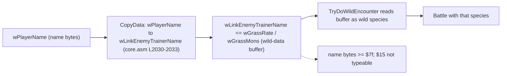

# MF-2: Old Man / Cinnabar name-buffer as wild data

## Mechanism summary

- This chapter documents the disclosed Old Man / Cinnabar-coast name-buffer family, publicly labelled the "Cinnabar Island" or "Missingno." coast glitch; it is named here only so it can be marked excluded, never presented as new.
- During the Old Man catch tutorial the game temporarily saves the player's name from `wPlayerName` into `wLinkEnemyTrainerName`, which occupies the same union slot as the wild-encounter buffer `wGrassRate`, so the name bytes land in the wild-encounter data [engine/battle/core.asm:L2030-2033], [ram/wram.asm:L2144-2155].
- Later, on Cinnabar Island's east coast, "left shore" half-blocks load grass encounters [engine/battle/wild_encounters.asm:L71-72] whose species byte is read from that same buffer, now holding leftover name bytes [engine/battle/wild_encounters.asm:L66-80].
- The family is DISCLOSED and therefore excluded under R1, and for species `$15` it is additionally bounded-impossible because that byte is not a typeable name glyph [constants/charmap.asm:L1].

## Legal-input sequence

- The setup is reachable entirely through legal inputs — name entry, the Old Man tutorial, and travel — as traced step by step below.

| Step | Input | Effect |
| --- | --- | --- |
| 1 | Enter a player name at the start of a new game | The name is stored in the 11-byte `wPlayerName` buffer [ram/wram.asm:L1715] |
| 2 | Complete the Viridian City Old Man catch tutorial | The tutorial script sets `BATTLE_TYPE_OLD_MAN` in `wBattleType` [scripts/ViridianCity.asm:L62-83], and the tutorial setup copies `wPlayerName` into `wLinkEnemyTrainerName` (which is the same memory as `wGrassRate`), seeding the wild-data buffer with name bytes [engine/battle/core.asm:L2030-2033] |
| 3 | Let a Ball be thrown during that Old Man battle | The Old Man branch of `ItemUseBall` copies the buffer back into `wPlayerName`, restoring the name; the bytes already written into `wGrassRate` persist [engine/items/item_effects.asm:L159-164] |
| 4 | Travel to Cinnabar Island and step onto an east-coast "left shore" tile | The half-block defaults to a grass encounter [engine/battle/wild_encounters.asm:L71-72] |
| 5 | Trigger the encounter | The buffer byte is read and stored as the wild species [engine/battle/wild_encounters.asm:L66-80] |

- Which species appears is therefore fully determined by the stored name bytes, and those bytes are bounded by the character map covered in the next section [engine/battle/wild_encounters.asm:L66-80].

## Code-cited mechanism

- The name is written into the wild-encounter buffer during the Old Man tutorial setup, not by the ball throw. `CopyData` copies `bc` bytes from `hl` to `de` [home/copy.asm:L15-16], and the tutorial setup sets `hl = wPlayerName` (source) and `de = wLinkEnemyTrainerName` (destination) [engine/battle/core.asm:L2030-2033]:

```asm
ld hl, wPlayerName
ld de, wLinkEnemyTrainerName
ld bc, NAME_LENGTH
```

- The in-source comment records the intent directly: the player name is temporarily saved in `wLinkEnemyTrainerName`, and because that label occupies the same union slot as `wGrassRate` the copy lands in the wild-encounter data; a documented oversight leaves it un-overwritten on Cinnabar Island and Route 21 [engine/battle/core.asm:L2024-2029]. That union is declared in WRAM, where `wLinkEnemyTrainerName` aliases `wGrassRate`/`wGrassMons` [ram/wram.asm:L2144-2155].
- The copy in the Old Man branch of `ItemUseBall` runs later and goes the other way — its source operand is `wGrassRate` and its destination is `wPlayerName`, so it restores the name from the buffer rather than seeding it [engine/items/item_effects.asm:L159-164]:

```asm
ld hl, wGrassRate
ld de, wPlayerName
ld bc, NAME_LENGTH
```

- The in-source comment on that later copy reads "save the player's name in the Wild Monster data", but the operand order (`hl = wGrassRate`, `de = wPlayerName`) shows it runs buffer-to-name: it restores the name the tutorial setup had already stashed in the buffer [home/copy.asm:L15-16].

- `wPlayerName` is declared as `ds NAME_LENGTH` [ram/wram.asm:L1715], `NAME_LENGTH` equals 11 [constants/text_constants.asm:L3], and the destination `wGrassRate`/`wGrassMons` is the wild-encounter data buffer [ram/wram.asm:L2145-2151].
- The Old Man battle type that reaches this branch is set from a normal input path — the Viridian City catch tutorial — which writes `BATTLE_TYPE_OLD_MAN` into `wBattleType` [scripts/ViridianCity.asm:L62-83].

```asm
ld a, BATTLE_TYPE_OLD_MAN
ld [wBattleType], a
```

- `BATTLE_TYPE_OLD_MAN` is the value `1` in the battle-type constant list [constants/battle_constants.asm:L42-44].
- On Cinnabar Island's east coast, a "left shore" half-block's bottom-left tile is not the water tile `$14`, so the half-block is treated as grass and the lookup points at `wGrassMons` [engine/battle/wild_encounters.asm:L71-72].

```asm
; since the bottom right tile of a "left shore" half-block is $14 but the bottom left tile is not,
; "left shore" half-blocks (such as the one in the east coast of Cinnabar) load grass encounters.
```

- `TryDoWildEncounter` then reads a byte from that buffer and stores it as the wild species in `wCurPartySpecies` and `wEnemyMonSpecies2` [engine/battle/wild_encounters.asm:L66-80].

```asm
ld a, [hl]
ld [wCurPartySpecies], a
ld [wEnemyMonSpecies2], a
```

- Because the buffer now holds name bytes, the species index equals whatever byte the player typed into that position of the name [engine/battle/wild_encounters.asm:L66-80].

### Required Mermaid data-flow diagram



- The character map bounds which byte values a name can contain: bytes `$00`–`$17` are `TX_*` text-control codes, not typeable glyphs [constants/charmap.asm:L1].
- Every typeable name glyph is a high byte at or above `$7f` (that is, `≥ $7f`): space is `$7f` [constants/charmap.asm:L63], `A` is `$80` [constants/charmap.asm:L92], `B` is `$81` [constants/charmap.asm:L93], `Z` is `$99` [constants/charmap.asm:L117], `a` is `$a0` [constants/charmap.asm:L126], and `0` is `$f6` [constants/charmap.asm:L187].
- Mew's species index is `$15` [constants/pokemon_constants.asm:L30], which lies inside the `$00`–`$17` control-code region and can never be produced by a name character [constants/charmap.asm:L1].
- Therefore the name-buffer path cannot place species `$15` into the wild-encounter buffer, and no amount of name entry can make Mew appear through it [constants/charmap.asm:L1].

## Catch step

- For a name byte that is itself a valid species index, the resulting encounter is an ordinary wild battle caught through `ItemUseBall` [engine/items/item_effects.asm:L104] and its catch-rate comparison [engine/items/item_effects.asm:L300-303].
- Mew's catch rate would be 45 in such a comparison [data/pokemon/base_stats/mew.asm:L7], but because `$15` is untypeable no Mew battle can arise from this path [constants/charmap.asm:L1]; see the [Game mechanics reference](../02-game-mechanics-reference.md) for the full catch algorithm.

## Novelty verdict (R1)

- Verdict: **DISCLOSED → EXCLUDED**, and additionally **bounded-impossible for `$15`**.
- This is the disclosed Cinnabar Island / "Missingno." name-buffer family and is never presented here as a new technique.
- The in-source name save is genuine [engine/battle/core.asm:L2030-2033], but the character-map bound makes species `$15` unreachable through it [constants/charmap.asm:L1]; see [Novelty verification](../03-novelty-verification.md) for the disclosed-corpus comparison.

## Inputs-only verdict (R2)

- Verdict: **Input-reachable = Yes** — name entry, the Old Man tutorial [scripts/ViridianCity.asm:L62-83], and travel to the Cinnabar coast [engine/battle/wild_encounters.asm:L71-72] are all legal in-game inputs.
- However, it **cannot produce `$15`**, because that byte is not a typeable name glyph [constants/charmap.asm:L1].

## Limitations

- Disclosed family: the Cinnabar / "Missingno." name-buffer glitch is already public and is excluded under R1.
- Even setting R1 aside, the character-map bound makes byte `$15` unreachable by any name character, so Mew cannot be produced [constants/charmap.asm:L1].
- The copy transfers only `NAME_LENGTH` bytes [constants/text_constants.asm:L3] from `wPlayerName` [ram/wram.asm:L1715] into the wild buffer [ram/wram.asm:L2145-2151], so only those buffer positions are ever influenced by the name.
- See [Conclusion and limitations](../04-conclusion-and-limitations.md) for the broader "implemented but unplaced" finding.
