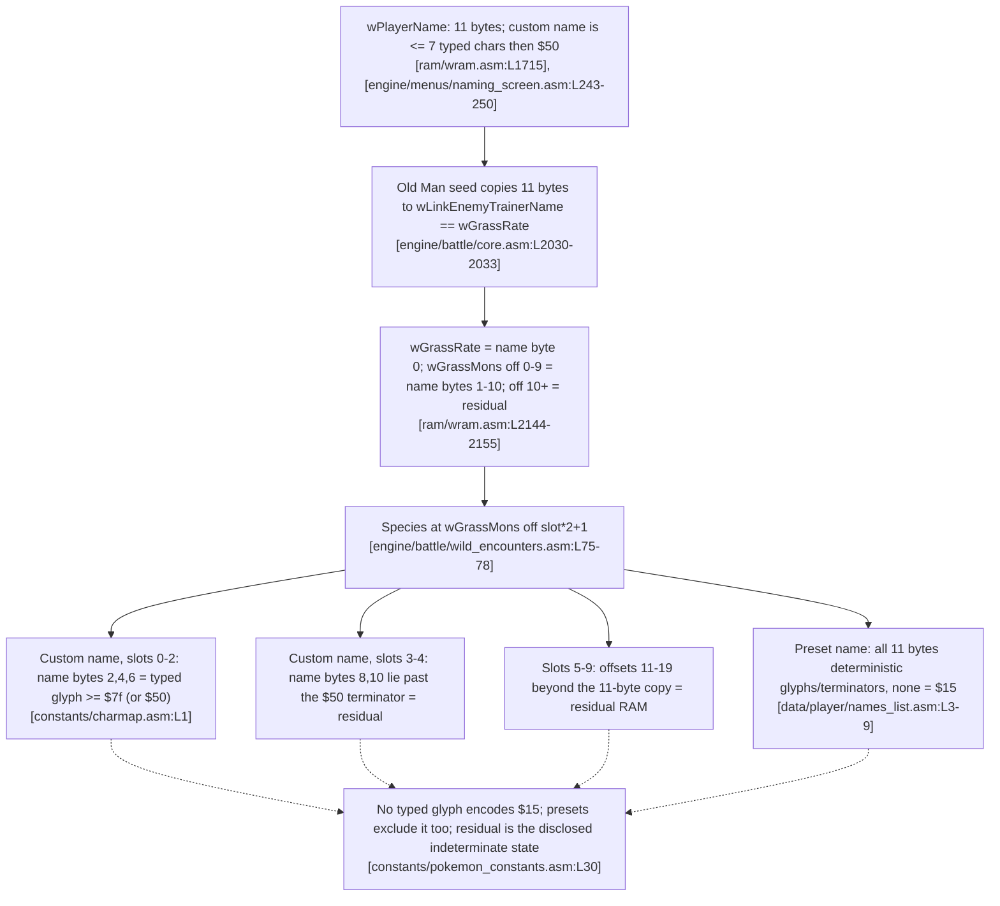

# MF-2: Old Man / Cinnabar name-buffer as wild data

## Mechanism summary

- This chapter documents the disclosed Old Man / Cinnabar-coast name-buffer family, publicly labelled the "Cinnabar Island" or "Missingno." coast glitch; it is named here only so it can be marked excluded, never presented as new.
- During the Old Man catch tutorial the game temporarily saves the player's name from `wPlayerName` into `wLinkEnemyTrainerName`, which occupies the same union slot as the wild-encounter buffer `wGrassRate`, so the name bytes land in the wild-encounter data `[engine/battle/core.asm:L2030-2033]`, `[ram/wram.asm:L2144-2155]`.
- Later, on Cinnabar Island's east coast, "left shore" half-blocks load grass encounters `[engine/battle/wild_encounters.asm:L71-72]` whose species byte is read from that same buffer, now holding leftover name bytes `[engine/battle/wild_encounters.asm:L66-80]`.
- The family is DISCLOSED and therefore excluded under R1, and for species `$15` typed input is additionally bounded out, because that byte is neither a typeable name glyph nor the `$50` string terminator `[constants/charmap.asm:L1]`.

## Legal-input sequence

- The setup is reachable entirely through legal inputs — name entry, the Old Man tutorial, and travel — as traced step by step below.

| Step | Input | Effect |
| --- | --- | --- |
| 1 | Enter a player name at the start of a new game | The name is stored in the 11-byte `wPlayerName` buffer `[ram/wram.asm:L1715]` |
| 2 | Complete the Viridian City Old Man catch tutorial | The tutorial script sets `BATTLE_TYPE_OLD_MAN` in `wBattleType` `[scripts/ViridianCity.asm:L62-83]`, and the tutorial setup copies `wPlayerName` into `wLinkEnemyTrainerName` (which is the same memory as `wGrassRate`), seeding the wild-data buffer with name bytes `[engine/battle/core.asm:L2030-2033]` |
| 3 | Let a Ball be thrown during that Old Man battle | The Old Man branch of `ItemUseBall` copies the buffer back into `wPlayerName`, restoring the name; the bytes already written into `wGrassRate` persist `[engine/items/item_effects.asm:L159-164]` |
| 4 | Travel to Cinnabar Island and step onto an east-coast "left shore" tile | The half-block defaults to a grass encounter `[engine/battle/wild_encounters.asm:L71-72]` |
| 5 | Trigger the encounter | The buffer byte is read and stored as the wild species `[engine/battle/wild_encounters.asm:L66-80]` |

- Which species appears is therefore fully determined by the stored name bytes, and those bytes are bounded by the character map covered in the next section `[engine/battle/wild_encounters.asm:L66-80]`.

## Code-cited mechanism

- The name is written into the wild-encounter buffer during the Old Man tutorial setup, not by the ball throw. `CopyData` copies `bc` bytes from `hl` to `de` `[home/copy.asm:L15-16]`, and the tutorial setup sets `hl = wPlayerName` (source) and `de = wLinkEnemyTrainerName` (destination) `[engine/battle/core.asm:L2030-2033]`:

```asm
ld hl, wPlayerName
ld de, wLinkEnemyTrainerName
ld bc, NAME_LENGTH
```

- The in-source comment records the intent directly: the player name is temporarily saved in `wLinkEnemyTrainerName`, and because that label occupies the same union slot as `wGrassRate` the copy lands in the wild-encounter data; a documented oversight leaves it un-overwritten on Cinnabar Island and Route 21 `[engine/battle/core.asm:L2024-2029]`. That union is declared in WRAM, where `wLinkEnemyTrainerName` aliases `wGrassRate`/`wGrassMons` `[ram/wram.asm:L2144-2155]`.
- The copy in the Old Man branch of `ItemUseBall` runs later and goes the other way — its source operand is `wGrassRate` and its destination is `wPlayerName`, so it restores the name from the buffer rather than seeding it `[engine/items/item_effects.asm:L159-164]`:

```asm
ld hl, wGrassRate
ld de, wPlayerName
ld bc, NAME_LENGTH
```

- The in-source comment on that later copy reads "save the player's name in the Wild Monster data", but the operand order (`hl = wGrassRate`, `de = wPlayerName`) shows it runs buffer-to-name: it restores the name the tutorial setup had already stashed in the buffer `[home/copy.asm:L15-16]`.

- `wPlayerName` is declared as `ds NAME_LENGTH` `[ram/wram.asm:L1715]`, `NAME_LENGTH` equals 11 `[constants/text_constants.asm:L3]`, and the destination `wGrassRate`/`wGrassMons` is the wild-encounter data buffer `[ram/wram.asm:L2145-2151]`.
- The Old Man battle type that reaches this branch is set from a normal input path — the Viridian City catch tutorial — which writes `BATTLE_TYPE_OLD_MAN` into `wBattleType` `[scripts/ViridianCity.asm:L62-83]`.

```asm
ld a, BATTLE_TYPE_OLD_MAN
ld [wBattleType], a
```

- `BATTLE_TYPE_OLD_MAN` is the value `1` in the battle-type constant list `[constants/battle_constants.asm:L42-44]`.
- On Cinnabar Island's east coast, a "left shore" half-block's bottom-left tile is not the water tile `$14`, so the half-block is treated as grass and the lookup points at `wGrassMons` `[engine/battle/wild_encounters.asm:L71-72]`.

```asm
; since the bottom right tile of a "left shore" half-block is $14 but the bottom left tile is not,
; "left shore" half-blocks (such as the one in the east coast of Cinnabar) load grass encounters.
```

- `TryDoWildEncounter` reads the species from `wGrassMons` at an offset fixed by the chosen encounter slot: the slot table stores each slot's offset as `slot * 2` `[data/wild/probabilities.asm:L4-9]`, the code loads that offset into `c` and points `hl` at `wGrassMons` `[engine/battle/wild_encounters.asm:L65-66]`, adds the offset `[engine/battle/wild_encounters.asm:L75]`, then reads the level at that offset and the species at the *following* byte before storing it to `wCurPartySpecies` and `wEnemyMonSpecies2` `[engine/battle/wild_encounters.asm:L76-80]`.

```asm
ld a, [hl]
ld [wCurPartySpecies], a
ld [wEnemyMonSpecies2], a
```

- So each slot's species byte sits at `wGrassMons + slot*2 + 1` — the odd offsets `{1, 3, 5, 7, 9, 11, 13, 15, 17, 19}` within `wGrassMons` `[engine/battle/wild_encounters.asm:L75-78]`.
- The Old Man seed copies only `NAME_LENGTH` (11) bytes `[constants/text_constants.asm:L3]` into the union base, where `wLinkEnemyTrainerName` aliases `wGrassRate` `[ram/wram.asm:L2144-2155]`; that fills `wGrassRate` (= name byte 0) and `wGrassMons` offsets `0`–`9` (= name bytes 1–10), while `wGrassMons` offsets `10` and beyond keep whatever residual bytes were already present `[engine/battle/core.asm:L2030-2033]`.
- Mapping the species offsets onto that fill: encounter slots 0–4 read `wGrassMons` offsets `1, 3, 5, 7, 9`, i.e. name bytes 2, 4, 6, 8, and 10; encounter slots 5–9 read `wGrassMons` offsets `11, 13, 15, 17, 19`, which lie beyond the 11-byte copy and so read residual RAM, not name bytes `[engine/battle/wild_encounters.asm:L75-78]`.
- A **custom** player name is capped at seven typed characters: the naming screen rejects further input once the entered length reaches `PLAYER_NAME_LENGTH - 1`, which is 7 `[constants/text_constants.asm:L1]`, `[engine/menus/naming_screen.asm:L243-250]`. So `wPlayerName` bytes 0–6 hold typed glyphs (or an earlier `$50` if the name is shorter), byte 7 holds the `$50` terminator, and bytes 8–10 are residual RAM the player never typed. Because the species slots read name bytes 2, 4, 6, 8, and 10, only slots 0–2 (name bytes 2, 4, 6) can carry a typed glyph in a custom name; slots 3–4 (name bytes 8, 10) fall past the terminator into residual, exactly like slots 5–9 `[engine/battle/wild_encounters.asm:L75-78]`.

### Required Mermaid data-flow diagram



- The character map bounds which byte values a *typed* name byte can hold: bytes `$00`–`$17` are `TX_*` text-control codes, not typeable glyphs `[constants/charmap.asm:L1]`, and every typeable name glyph is a high byte at or above `$7f` — space is `$7f` `[constants/charmap.asm:L63]`, `A` is `$80` `[constants/charmap.asm:L92]`, `Z` is `$99` `[constants/charmap.asm:L117]`, `a` is `$a0` `[constants/charmap.asm:L126]`, and `0` is `$f6` `[constants/charmap.asm:L187]`; the only sub-`$7f` byte a name can carry is the `"@"` string terminator `$50` `[constants/charmap.asm:L12]`.
- Mew's species index `$15` `[constants/pokemon_constants.asm:L30]` lies inside the `$00`–`$17` control-code region, so it is neither a typeable glyph nor the `$50` terminator and can never be produced by a *typed* name byte `[constants/charmap.asm:L1]`.
- Consequently the species bytes that can derive from a *typed* character in a custom name — slots 0–2, reading name bytes 2, 4, and 6 `[engine/battle/wild_encounters.asm:L75-78]` — can never equal `$15`.
- The remaining species bytes are not typed characters. For a custom name, slots 3–4 read name bytes 8 and 10, which lie past the seven-character cap and its `$50` terminator `[engine/menus/naming_screen.asm:L243-250]`, and slots 5–9 read `wGrassMons` offsets beyond the 11-byte copy `[engine/battle/wild_encounters.asm:L75-78]`, `[engine/battle/core.asm:L2030-2033]`. Those bytes are indeterminate residual — exactly the disclosed "Missingno." indeterminate condition, excluded under R1 — and are not a controllable, inputs-only lever to `$15`.

### Preset names are fully determined and exclude `$15`

- A player who does not type a name may instead pick one of three preset names from the intro menu, which are loaded from `DefaultNamesPlayerList` `[data/player/names_list.asm:L3-9]` by `GetDefaultName` — a 20-byte copy into `wNameBuffer` `[engine/movie/oak_speech/oak_speech2.asm:L192-214]` — followed by an 11-byte copy into `wPlayerName` `[engine/movie/oak_speech/oak_speech2.asm:L70-77]`. Because that copy spills across adjacent list entries, all 11 `wPlayerName` bytes are deterministic ROM data with no residual.
- The presets are build-specific: **RED**, **ASH**, **JACK** in Red and **BLUE**, **GARY**, **JOHN** in Blue `[constants/player_constants.asm:L1-20]`. Every character is a letter glyph (`$80`–`$99`) `[constants/charmap.asm:L92-117]`, a space (`$7f`) `[constants/charmap.asm:L63]`, or the `$50` terminator `[constants/charmap.asm:L12]` — never a byte in the `$00`–`$17` control region `[constants/charmap.asm:L1]`. The resulting sequences and the five species bytes each would place on the coast are:

| Build | Preset | `wPlayerName` bytes 0–10 | Species bytes at slots 0–4 (name bytes 2,4,6,8,10) |
| --- | --- | --- | --- |
| Red | RED | `$91 $84 $83 $50 $80 $92 $87 $50 $89 $80 $82` | `$83 $80 $87 $89 $82` |
| Red | ASH | `$80 $92 $87 $50 $89 $80 $82 $8a $50 $8d $84` | `$87 $89 $82 $50 $84` |
| Red | JACK | `$89 $80 $82 $8a $50 $8d $84 $96 $7f $8d $80` | `$82 $50 $84 $7f $80` |
| Blue | BLUE | `$81 $8b $94 $84 $50 $86 $80 $91 $98 $50 $89` | `$94 $50 $80 $98 $89` |
| Blue | GARY | `$86 $80 $91 $98 $50 $89 $8e $87 $8d $50 $8d` | `$91 $50 $8e $8d $8d` |
| Blue | JOHN | `$89 $8e $87 $8d $50 $8d $84 $96 $7f $8d $80` | `$87 $50 $84 $7f $80` |

- In none of the six presets does any of the five species slots equal `$15` `[constants/pokemon_constants.asm:L30]`; every value is a glyph or the `$50` terminator. Preset selection therefore cannot place Mew on the Cinnabar coast either.

## Catch step

- For a name byte that is itself a valid species index, the resulting encounter is an ordinary wild battle caught through `ItemUseBall` `[engine/items/item_effects.asm:L104]` and its catch-rate comparison `[engine/items/item_effects.asm:L300-303]`.
- Mew's catch rate would be 45 in such a comparison `[data/pokemon/base_stats/mew.asm:L7]`, but no typed name byte can encode `$15` `[constants/charmap.asm:L1]`, and the only bytes not so bounded are the disclosed indeterminate residual, so no inputs-only Mew battle arises from this path; see the [Game mechanics reference](../02-game-mechanics-reference.md) for the full catch algorithm.

## Novelty verdict (R1)

- Verdict: **DISCLOSED → EXCLUDED**, and additionally **bounded against typed input for `$15`**.
- This is the disclosed Cinnabar Island / "Missingno." name-buffer family and is never presented here as a new technique.
- The in-source name save is genuine `[engine/battle/core.asm:L2030-2033]`, but no typed name byte can encode `$15` `[constants/charmap.asm:L1]`, so the typed-input positions (custom-name slots 0–2) cannot yield Mew, the residual positions (custom-name slots 3–9) are the disclosed indeterminate state, and the three preset names per build are deterministic sequences that contain no `$15` `[data/player/names_list.asm:L3-9]`; see [Novelty verification](../03-novelty-verification.md) for the disclosed-corpus comparison.

## Inputs-only verdict (R2)

- Verdict: **Input-reachable = Yes** — name entry, the Old Man tutorial `[scripts/ViridianCity.asm:L62-83]`, and travel to the Cinnabar coast `[engine/battle/wild_encounters.asm:L71-72]` are all legal in-game inputs.
- However, it **cannot produce `$15` from typed input**, because that byte is neither a typeable name glyph nor the `$50` terminator `[constants/charmap.asm:L1]`; the species bytes that are not typed characters (custom-name slots 3–9) are the disclosed indeterminate residual `[engine/battle/wild_encounters.asm:L75-78]`, and every preset name is a deterministic glyph sequence that likewise never encodes `$15` `[data/player/names_list.asm:L3-9]`.

## Limitations

- Disclosed family: the Cinnabar / "Missingno." name-buffer glitch is already public and is excluded under R1.
- Even setting R1 aside, no name *character* can encode byte `$15` `[constants/charmap.asm:L1]`, so the species bytes read from typed positions of a custom name (slots 0–2) cannot be Mew; the bytes not derived from typed characters (custom-name slots 3–9) are the disclosed indeterminate state `[engine/battle/wild_encounters.asm:L75-78]`, and the preset names are deterministic sequences with no `$15` `[data/player/names_list.asm:L3-9]`.
- The copy transfers only `NAME_LENGTH` bytes `[constants/text_constants.asm:L3]` from `wPlayerName` `[ram/wram.asm:L1715]` into the wild buffer `[ram/wram.asm:L2145-2151]`, so only those buffer positions are ever influenced by the name.
- See [Conclusion and limitations](../04-conclusion-and-limitations.md) for the broader "implemented but unplaced" finding.
