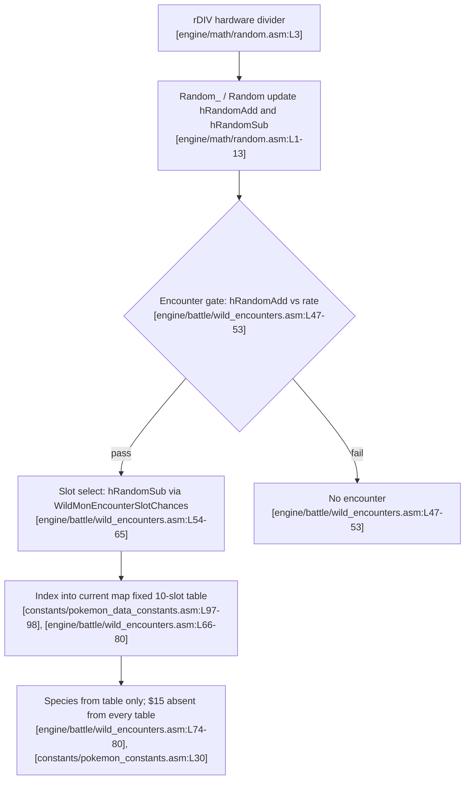

# MF-3: RNG manipulation of wild encounters

## Mechanism summary

- The game's random-number generator is deterministic: `Random_` derives its 16-bit value by reading the free-running hardware divider register `rDIV`, then updating the seed bytes `hRandomAdd` and `hRandomSub` `[engine/math/random.asm:L1-13]`.
- Because `rDIV` is read directly from hardware, a player can perturb the generator only through the timing of legal inputs — stepping or pressing a button a frame earlier or later reseeds it `[engine/math/random.asm:L3]`.
- The question this chapter answers is whether such precise timing can steer a wild encounter into producing Mew, whose species index is `$15` `[constants/pokemon_constants.asm:L30]`.
- The answer, established by the bounding proof below, is no: wild-species selection is strictly table-bounded, and no map's encounter table contains Mew `[engine/battle/wild_encounters.asm:L74-80]`.

## Legal-input sequence

- Every input that can influence encounter RNG is a standard controller action, so this mechanism family is genuinely input-reachable under R2; the reachable inputs are listed below `[engine/battle/core.asm:L6664]`.

| Step | Input | Effect |
| --- | --- | --- |
| 1 | Walk onto a grass or water tile with the D-pad | Each step invokes `TryDoWildEncounter` to test for a wild battle `[engine/battle/core.asm:L6664]` |
| 2 | Vary the frame-level timing of that step (press the D-pad a frame earlier or later) | Shifts the `rDIV`-seeded value read by `Random_` `[engine/math/random.asm:L3]` |
| 3 | Keep stepping or re-enter the map to resample | Re-runs the encounter gate and slot selection with fresh seeds `[engine/battle/wild_encounters.asm:L47-53]` |

- All of these steps use only the D-pad and normal movement, so they are fully R2-legal; however, the mechanism proof below shows the reachable outcome set excludes `$15` `[engine/battle/wild_encounters.asm:L74-80]`.

## Code-cited mechanism

The RNG core reads the hardware divider `rDIV` and folds it into the two seed bytes `hRandomAdd` and `hRandomSub` `[engine/math/random.asm:L1-13]`:

```asm
	ldh a, [rDIV]
	ld b, a
	ldh a, [hRandomAdd]
```

The public `Random` wrapper calls `Random_` and returns the freshly computed `hRandomAdd` in the accumulator `[home/random.asm:L1-12]`, and both seed bytes reside in HRAM `[ram/hram.asm:L270-271]`.

An encounter must first pass the encounter gate, where the map's encounter rate is compared against `hRandomAdd` and a higher-or-equal random value aborts the encounter `[engine/battle/wild_encounters.asm:L47-53]`:

```asm
	ldh a, [hRandomAdd]
	cp b
	jr nc, .CantEncounter2
```

If the gate passes, the second seed byte `hRandomSub` is compared against the cumulative `WildMonEncounterSlotChances` list to choose one encounter slot `[engine/battle/wild_encounters.asm:L54-65]`:

```asm
	ldh a, [hRandomSub]
	ld b, a
	ld hl, WildMonEncounterSlotChances
```

That chance list defines exactly ten slots whose probabilities sum to 256 `[data/wild/probabilities.asm:L11-28]`, and the slot count is fixed at build time by `NUM_WILDMONS EQU 10` `[constants/pokemon_data_constants.asm:L97-98]`.

The chosen slot then indexes the current map's `wGrassMons` or `wWaterMons` table, and the species byte at that offset is stored to `wCurPartySpecies` and `wEnemyMonSpecies2` `[engine/battle/wild_encounters.asm:L66-80]`:

```asm
	ld a, [hl]
	ld [wCurPartySpecies], a
	ld [wEnemyMonSpecies2], a
```

Bounding proof: the wild species can only ever be one of the at-most-ten entries already defined in the current map's fixed table, because the species byte is read directly from that table offset `[engine/battle/wild_encounters.asm:L74-80]` and the table length is fixed at build time `[constants/pokemon_data_constants.asm:L97-98]`. The RNG chooses only which slot is read and never contributes the species value itself, so it cannot synthesize a species index that is absent from the table `[engine/battle/wild_encounters.asm:L54-65]`. An exhaustive audit of `data/wild/` finds no `MEW` entry in any encounter table, so Mew's index `$15` occupies no slot on any map `[constants/pokemon_constants.asm:L30]`, and therefore no attainable RNG state can place `$15` into `wCurPartySpecies` `[engine/battle/wild_encounters.asm:L74-80]`.

The flowchart below summarizes this pipeline and its table-bounded terminal state `[engine/battle/wild_encounters.asm:L74-80]`.



## Catch step

- Even if a Mew encounter could somehow be produced, capture would still run through `ItemUseBall` `[engine/items/item_effects.asm:L104]` and its catch-rate comparison `[engine/items/item_effects.asm:L300-303]` against Mew's catch rate of 45 `[data/pokemon/base_stats/mew.asm:L7]`.
- Because no Mew encounter can be produced by RNG manipulation `[engine/battle/wild_encounters.asm:L74-80]`, this catch step is moot for MF-3; the full capture walk-through lives in the [Game mechanics reference](../02-game-mechanics-reference.md).

## Novelty verdict (R1)

- Verdict: **EXCLUDED — bounding proof (bounded-impossible).** RNG manipulation is not a disclosed *trick* here but the honest negative result — the RNG cannot conjure a species that is absent from the map's table `[engine/battle/wild_encounters.asm:L74-80]`.
- The adjudication of this verdict against the disclosed corpus is recorded in [Novelty verification](../03-novelty-verification.md).

## Inputs-only verdict (R2)

- Verdict: **Input-reachable = Yes.** Input timing is a legal standard-controller action that only perturbs the `rDIV`-seeded RNG and injects no data of its own `[engine/math/random.asm:L3]`.
- However, the reachable species set is table-bounded `[engine/battle/wild_encounters.asm:L74-80]`, so this input-reachable path **cannot produce `$15`** `[constants/pokemon_constants.asm:L30]`.

## Limitations

- The RNG selects only among the fixed encounter slots of the current map; it never yields a species value outside that table `[engine/battle/wild_encounters.asm:L54-65]`.
- Each map's encounter table holds at most ten species entries, a count fixed at build time `[constants/pokemon_data_constants.asm:L97-98]`.
- No `data/wild/` table lists Mew, so its index `$15` is unreachable through any slot `[constants/pokemon_constants.asm:L30]`.
- Therefore timing manipulation — however precise — cannot yield Mew `[engine/battle/wild_encounters.asm:L74-80]`; this is the single most important bounding fact of the guide, carried forward in [Conclusion and limitations](../04-conclusion-and-limitations.md).
